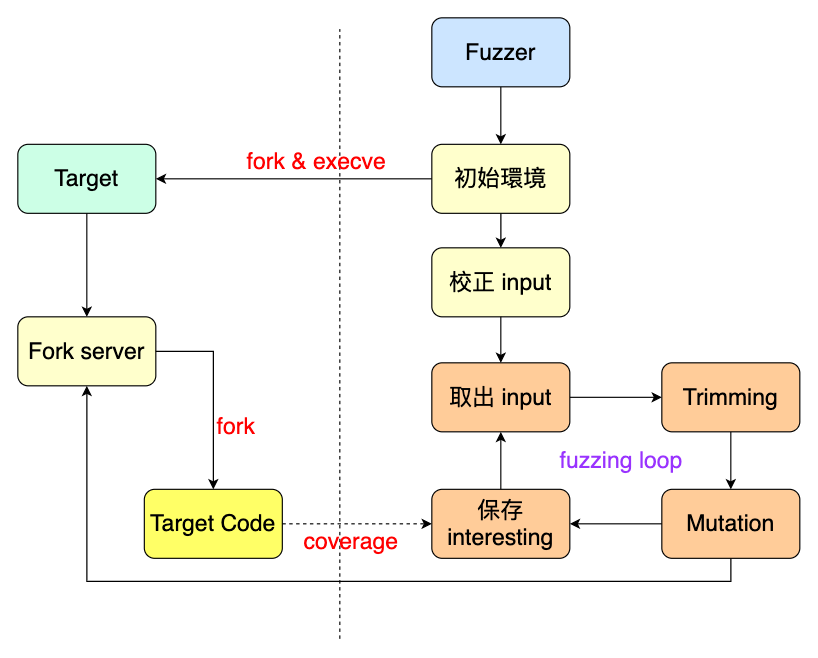

# [Day 10] 近代 fuzzer 始祖 - AFL - Fuzzer - Interesting input


每次做完 mutation 都會執行 `common_fuzz_stuff()`，而此 function 會呼叫 `run_target()` 以及 `save_if_interesting()` 來執行 target 並分析，程式碼如下：

```c
EXP_ST u8 common_fuzz_stuff(char** argv, u8* out_buf, u32 len)
{
    u8 fault;
    // 將 mutated 的 input data 寫入 <output_dir>/.cur_input
    // 所對應到的 fd
    write_to_testcase(out_buf, len);
	// 執行 target
    fault = run_target(argv, exec_tmout);
	// 執行 save_if_interesting() 分析此次 input data
	save_if_interesting(argv, out_buf, len, fault);
    return 0;
}
```


### Interesting input

先前已經介紹過 `run_target()`，在此我們關注的是 `save_if_interesting()`，其功能是用來保存 interesting input，並做更深入的分析，程式碼如下：

```c
static u8 save_if_interesting(char** argv, void* mem, u32 len, u8 fault)
{
    // 如果此 input 有走到新的 coverage，或是走到
    // 更多次 edge，就表示為 interesting，否則直接
    // return
    if (!(hnb = has_new_bits(virgin_bits)))
      return 0;

    // 為其產生檔案名稱並加到 queue 當中
    fn = alloc_printf("%s/queue/id:%06u,%s", out_dir, queued_paths,
                      describe_op(hnb));
    add_to_queue(fn, len, 0);
	// 新進來的 queue entry 會是 queue_top，更新
    // 其 checksum
    queue_top->exec_cksum = hash32(trace_bits, MAP_SIZE, HASH_CONST);
    // 校正此 input，檢測是否正常
    res = calibrate_case(argv, queue_top, mem, queue_cycle - 1, 0);
    // 保存至檔案當中
    fd = open(fn, O_WRONLY | O_CREAT | O_EXCL, 0600);
    ck_write(fd, mem, len, fn);
    close(fd);
    keeping = 1;

	// 檢查是否發生 fault
    switch (fault) {
        // 執行期間出現 timeout
        case FAULT_TMOUT:
            // timeout 異常發生太多次，直接不理會
            if (unique_hangs >= 500) return keeping;
            
            // 簡化 coverage
            // 如果過去有相同 coverage 造成 timeout，
            // 則不額外保存 timeout input
			simplify_trace((u64*)trace_bits);
            if (!has_new_bits(virgin_tmout))
                return keeping;
            
            // 重新執行一次，確保 timeout 確實會發生
            write_to_testcase(mem, len);
            new_fault = run_target(argv, hang_tmout);
			
            // 重新執行的結果是 crash
            if (new_fault == FAULT_CRASH) goto keep_as_crash;
            // 重新執行後什麼也不是
            if (new_fault != FAULT_TMOUT) return keeping;
            // 產生檔案名字
            fn = alloc_printf("%s/hangs/id:%06llu,%s", out_dir,
                              unique_hangs, describe_op(0));
            unique_hangs++;
            break;

        case FAULT_CRASH:
		keep_as_crash:
            total_crashes++;
            // crash 異常發生太多次，直接不理會
            if (unique_crashes >= 5000) return keeping;
            // 簡化 coverage
            simplify_trace((u64*)trace_bits);
            // 如果過去有相同 coverage 造成 crash，
            // 則不額外保存 crash input
            if (!has_new_bits(virgin_crash))
                return keeping;

            // 產生檔案名字
            fn = alloc_printf("%s/crashes/id:%06llu,sig:%02u,%s", out_dir,
                              unique_crashes, kill_signal, describe_op(0));
            unique_crashes++;
            break;

        default: return keeping;
    }

	// 保存 crash input 到 output directory 當中
    fd = open(fn, O_WRONLY | O_CREAT | O_EXCL, 0600);
    ck_write(fd, mem, len, fn);
    close(fd);
    ck_free(fn);

    return keeping;
}
```


---




到此已經介紹完整個 AFL fuzzer 的架構，這裡可以做個總結：

- 編譯時 afl-gcc 以及 afl-as 會為 target 的原始碼做插樁，插樁的內容為 fork server 以及蒐集 coverage 的程式碼
- afl-fuzzer 在初始環境後會先喚醒 fork server，並檢測 target 在一般 input 中是否能正常執行
- 進入 fuzzing loop，重複將每個 input 取出，並透過 trimming 階段取出 input 最重要的部分
- 對 input 做一系列的變異，並從中找出 interesing input，如果有造成 crash 則另外存成檔案


### Conclusion

雖然做法直觀，但其中存在許多可以優化的地方，像是對於不同的程式來說，各個變異所造成的效果可能不相同，因此可以變異本身也可以有優先順序。Fuzzing 相關的論文皆在提出諸如此類的優化，畢竟 fuzzing 都會跑很久，並且每秒執行的次數也很多，即使只能增加一些效率，但累積下來的差異還是很可觀的。

在後續的文章中，會帶讀者了解除了 userspace 之外的 fuzzer，像是 kernel fuzzer 或是 hypervisor，同時也包含一些經典的 fuzzer 優化方式。

