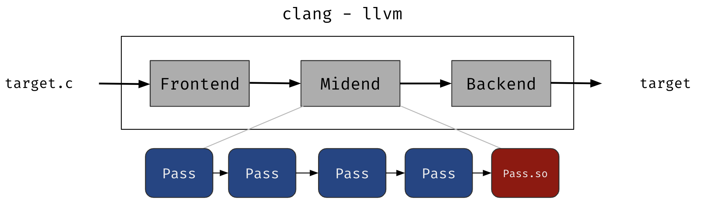

# [Day 11] Coverage-guided fuzzer - 對 source-code 程式做模糊測試


俗稱的 feedback-driven fuzzer 是指 fuzzer 並非漫無目的的隨機輸入與 mutation，而是透過執行結果的好壞來引導下次產生或挑選的輸出。根據 feedback 的來源大概可以分成兩種：

- Coverage-guided - 由程式碼覆蓋率作為引導，執行到越多程式碼越好
- Data-driven (?) - 讓特定資料或是變數的狀態變化越多越好


大部分 fuzzer 都是 coverage-guided fuzzer，目的是要想辦法在一定時間內執行越多次、走到越多程式碼，而目前較有代表性的為 ：

- [AFLplusplus](https://github.com/AFLplusplus/AFLplusplus) - 基於 AFL 的 fuzzing 框架，綜合了各個論文的研究結果，擁有不同的 mutator、scheduling algorithm 可以選擇。此外也提供較好的整合介面，讓研究人員可以測試自己的優化方法

反之 Data-driven fuzzer 會觀察程式在執行過程中的資料變化、不同輸入所造成的更動，而具體的資料會因為實作的不同而有所不同，像是變數值的變化、或者是記憶體的使用狀況，舉例來說：

- [INVSCOV](https://www.usenix.org/conference/usenixsecurity21/presentation/fioraldi) - 程式執行中總是會有一些 Invariant (不變量) 基本上不大會變動，而這篇論文提出的方法就是以讓這些不變量變動為目標做 fuzzing


後續有可能會介紹到 data-driven 的 fuzzer，不過在此還是著重在介紹較為主流的 coverage-guided fuzzer。


### Source-code program

前幾天介紹到的 AFL 是對有原始碼的程式做插樁，藉此蒐集 coverage，這種有原始碼的程式稱作 **source-code program**。但現實中沒有原始碼的程式其實佔了大多數，因為基本上程式都算是企業的資產，包含實作方法以及使用技術，因此不太可能開放原始碼，而這種只有執行檔，沒有原始碼的程式就稱作 **binary-only program**。


#### llvm pass

對於 source-code program 是使用插樁來蒐集 coverage，最直觀的方式就是在組譯前加上一段程式碼來紀錄執行狀態，不過如果使用 llvm toolchain 來編譯程式，則可以使用 **llvm pass** 來做更細粒度的插樁。LLVM 在編譯一支程式會經過以下步驟：



- Frontend (前端) - 會將 C source code 轉成 llvm IR，比較熟悉的 llvm 前端為 **clang**
- Midend - 將 llvm IR 做各種優化與操作，這些處理被稱作 llvm pass。結束後會再把 llvm IR 轉成 assembly code
- Backend (後端) - 將 assembly code 組譯成 executable，也就是可以用來執行的格式

llvm pass 可以做到的插樁粒度從 function level 到 instruction level 都可以，也可以針對一些條件來決定插樁程式碼的執行與否。自己定義的 llvm pass 會在第一輪的最後一個被執行，在上圖即為 "Pass.so"，也就代表傳入自定義的 llvm pass 是已經被優化完的 IR，實際上如果想要在優化前先執行自己的 pass 也可以。

llvm pass 因為容易上手，因此當今 fuzzer 雖然會支援 gcc，不過推薦使用 llvm compiler 來編譯。接下來會簡單介紹一下 llvm pass 的使用方法與說明，使用的環境為 llvm-14。


hello.cpp 的內容用於定義 llvm pass，內容參考[官方文件](https://llvm.org/docs/WritingAnLLVMPass.html)：

```c++
// include llvm pass 相關的 header file
#include "llvm/Pass.h"
#include "llvm/IR/Function.h"
#include "llvm/Support/raw_ostream.h"
#include "llvm/IR/LegacyPassManager.h"
#include "llvm/Transforms/IPO/PassManagerBuilder.h"

// include 的 function 都在 llvm namespace
using namespace llvm;

// 定義一個 anonymous namespace
// 讓所有 declaration 只會在目前的 file 中被看到
namespace {
	// 定義 FunctionPass 的 subclass
    struct Hello : public FunctionPass {
        // 屬於 Pass 的 ID
        static char ID;
        Hello() : FunctionPass(ID) {}
		// override 原本 FunctionPass 的抽象 method，
        // 可以定義要做插樁的行為
        virtual bool runOnFunction(Function &F) {
            errs() << "Hello: ";
            errs() << F.getName() << '\n';
            return false;
        }
    };
}

// 初始化 pass ID
char Hello::ID = 0;
// 註冊 pass，參數定義如下：
// 傳入 command argument 時使用 "hello" 來辨識
// 此 pass 的名稱為 "Hello World Pass"
static RegisterPass<Hello> X("hello", "Hello World Pass");
```

編譯 shared library 的指令：

```bash
`llvm-config-14 --bindir`/clang -c hello.cpp -o hello.o `llvm-config-14 --cppflags` -fPIC -fno-rtti
`llvm-config-14 --bindir`/clang -shared hello.o -o hello.so `llvm-config-14 --ldflags` -fPIC
```

- 會產生 shared library hello.so

test.c 為目標程式：

```c
#include <stdio.h>

int main ()
{
    printf("Hello LLVM!\n");
}
```

編譯 target 指令：

```bash
# 產生 llvm IR
clang -c -emit-llvm -o test.bc test.c

# 將 IR 餵入 optimizer 並執行 pass，
# 執行的過程中就會印出 "Hello: main" 的字串，代表
# llvm 正在處理當前的 hello pass
# 處理完的 IR 會輸出到 hello.ll
opt-14  -enable-new-pm=0 -load ./hello.so -hello -o hello.ll < test.bc

# 產生執行檔
clang -o hello hello.ll
```

如果有興趣的讀者可以參考 [AFL 的 llvm pass](https://github.com/google/AFL/blob/master/llvm_mode/afl-llvm-pass.so.cc)，能更了解如何實際運用在 fuzzer 上。


#### gcc

除了最原本的做法，gcc 似乎在 instrumentation 也提供了許多可以使用的選項，這方面我不是很熟，可以參考[官方文件](https://gcc.gnu.org/onlinedocs/gcc-8.1.0/gcc/Instrumentation-Options.html)的說明，不過如果是對每個 basic block 做插樁，在編譯時可以使用 option `-fsanitize-coverage=trace-pc`，此 option 能允許程式當中的每個 basic block 在執行前會呼叫 function `__sanitizer_cov_trace_pc()`，因此在此 function 當中定義蒐集 coverage 的行為，就能做到插樁的效果。不過不僅是 gcc 可以使用，這個選項 llvm 也有支援，所以不能夠算專屬於 gcc。

下面以簡單的範例介紹此 option 要怎麼使用，以及使用時可能會遇到的問題。test.c 為要被插樁的 target，trace.c 則定義 function `__sanitizer_cov_trace_pc()` 的內容。

test.c 的程式碼如下：

```c
#include <stdio.h>

// 實際定義會在 trace.c
// 如果在此宣告，則 __sanitizer_cov_trace_pc() 本身又會呼叫
// __sanitizer_cov_trace_pc()，會造成無窮遞迴而 crash
void __sanitizer_cov_trace_pc(void);

static void fun1(int a)
{
    printf("call fun1, and a = %d\n", a);
}

int main(int argc, char **argv)
{
    if (argc == 1) {
        puts("argc == 1");
        fun1(1);
    } else {
        puts("argc != 1");
        fun1(0);
    }
    return 0;
}
```

trace.c 的程式碼如下：

```c
#include <stdio.h>

// 插樁會呼叫到的 function，透過 compiler 的
// built-in function 取得 return address 並印出
void __sanitizer_cov_trace_pc(void)
{
    printf("call from %p\n", __builtin_extract_return_addr (__builtin_return_address (0)));
}
```

編譯指令：

```bash
gcc -c -fsanitize-coverage=trace-pc -o test.o test.c
gcc -c -o trace.o trace.c
gcc -o test test.o trace.o
```

執行結果：

```
$ ./test
call from 0x5555555551b2
call from 0x5555555551bd
argc == 1
call from 0x55555555517d
call fun1, and a = 1
call from 0x5555555551fb
call from 0x555555555205

$ ./test 2
call from 0x5555555551b2
call from 0x5555555551dd
argc != 1
call from 0x55555555517d
call fun1, and a = 0
call from 0x5555555551fb
call from 0x555555555205
```

唯一有差別的是當參數只有一個時，`if (argc == 1)` 會成立，因此執行第一段程式碼，對應到的位址為 `0x5555555551bd`；參數不只一個時，會執行第二段程式碼，對到的位址為 `0x5555555551dd`。


---


今天介紹了 source-code fuzzing 能夠利用什麼方法來蒐集 coverage，而明天會介紹在沒有 source code 的情況下，binary-only fuzzing 是如何取得 coverage 的。


### 參考資源

- [Understanding kcov – play with -fsanitize-coverage=trace-pc from the user space](https://davejingtian.org/2017/06/01/understanding-kcov-play-with-fsanitize-coveragetrace-pc-from-the-user-space/)
- [LLVM 寫一個 pass - 教學入門篇](https://kitoslab.blogspot.com/2012/10/llvm-pass.html)
- [Writing an LLVM Pass](https://llvm.org/docs/WritingAnLLVMPass.html)

