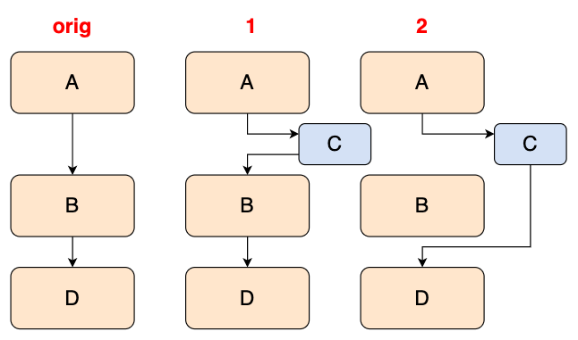
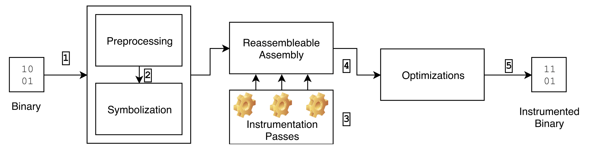

# [Day 12] Coverage-guided fuzzer - 對 binary-only 程式做模糊測試 - Static binary rewriting


### Binary-only program

在沒有 source code 的情況下，binary-only fuzzing 是取得 coverage 的方法大概可以分成三種，並且每種做法並不完全等於下方所介紹的，根據實作還是會有些許差異：

- **Static binary rewriting** - 靜態對 binary 做更新
  - Trampoline (detouring) - 將 basic block 開頭的 instruction 改成 `{call,jmp} XXXX` 跳到指定位址，而在位址 `XXXX` 會放蒐集 coverage 的 instruction，同時也還會執行/修補原本的程式片段，最後在跳回去
    - 代表性的論文/作法有： [以執行檔改寫支援涵蓋率導引之模糊測試](https://ndltd.ncl.edu.tw/cgi-bin/gs32/gsweb.cgi/login?o=dnclcdr&s=id=%22106NCTU5726039%22.&searchmode=basic)
  - Reassemble - 想辦法把要新增的 instruction 加到原本的 basic block 當中，難處在於要怎麼重組原本的指令，使其可以做到原程式邏輯，並且 instruction 的增加不會影響程式執行
    - 代表性的論文/作法有： Uroboros、Ramblr 以及 [RetroWrite](https://ieeexplore.ieee.org/stamp/stamp.jsp?tp=&arnumber=9152762) (由舊到新)
  
- **Dynamic binary instrumentation (DBI)** - 透過 emulator 可以模擬程式執行的功能，特別在把 basic block 轉成 IR 之前，先多插一段蒐集 coverage 的 IR，之後動態做模擬執行時就能知道執行了哪些 basic block
  - 代表性的論文/作法有： Intel Pin、DynamoRIO、QEMU

- **Other** - 使用一些較為特別的技巧做插樁
  - Hardware support - 指令集支援，例如 Intel-PT
  - ptrace - 能單步執行 process 並取得執行狀態
  - signal handler - 可以在程式中註冊接受到 interrupt 時會做的行為

動態與靜態各自的優點 (對方的缺點) 在於：

- 動態： 可以得知資料的狀態，像是結構或是型態，結果較為準確
- 靜態： 只做一次分析與修正，就能省下後續執行所造成的 overhead

這幾天的文章會詳細介紹各機制與其實作方法，而今天會先介紹 **Static binary rewriting**。


### Static binary rewriting - Trampoline

Trampoline 的中文意思為彈跳床，而在資訊術語中通常是指：改變原本的程式流程，讓程式在執行到一半時先跳去做其他的 subroutine，而 subroutine 除了會執行使用者指定的程式碼外，也可能會將原程式要做的事給做完，最後 subroutine 執行完後在跳回去。

舉個簡單的例子，原本程式的執行流程為 `orig`，而 `1` 就是使用 `C` 這個 trampoline 來蒐集 coverage，並在執行結束後回到原先的執行流程；`2` 的做法會直接替代掉原程式流程，直接在 `C` 當中做完 `B` 的行為。



如果是以程式碼為例子：

```assembly
A:
	mov rax, 1
	mov rbx, 2
	mov rcx, 3
	ret
	
B:
	mov rax, 4
	mov rbx, 5
	mov rcx, 6
	ret
	
C:
	mov rdx, qword ptr [rip + test_counter]
	inc rdx
	mov qword ptr [rip + test_counter], rdx
	ret

test_counter: .long 0
```

在不考慮 `call C` 與 `mov rax, {1,4}` instruction 長度，以及呼叫 function 所造成的 side-effect 的情況下，作法 `1` 會長得像：

```assembly
A:
	call C
	mov rbx, 2
	mov rcx, 3
	ret
	
B:
	call C
	mov rbx, 5
	mov rcx, 6
	ret
	
C:
	mov rdx, qword ptr [rip + test_counter]
	inc rdx
	mov qword ptr [rip + test_counter], rdx
	ret

test_counter: .long 0
```

做法 `2` 則是：

```assembly
A:
	jmp C_1

B:
	jmp C_2

C_1:
	mov rdx, qword ptr [rip + test_counter]
	inc rdx
	mov qword ptr [rip + test_counter], rdx
	mov rax, 1
	mov rbx, 2
	mov rcx, 3
	ret
	
C_2:
	mov rdx, qword ptr [rip + test_counter]
	inc rdx
	mov qword ptr [rip + test_counter], rdx
	mov rax, 4
	mov rbx, 5
	mov rcx, 6
	ret

test_counter: .long 0
```

而其中的難點也十分明顯，像是：

- 當 instruction `call` 或 `jmp` 超過原本 function 的長度時該怎麼處理？
- 如果 function 中執行記憶體存取，那 trampoline 中的記憶體 offset 要怎麼算？
- trampoline 的程式碼要放在哪？
- 要怎麼執行到被 patch 掉的 instruction，像是作法 `1` 當中的 `mov rax, {1,4}`？

諸如此類的問題還有很多，因此這部分也是有許多人在做相關的研究。


### Static binary rewriting - Reassemble

Reassemble 的核心概念在：把原本的 assembly code 做修改後，還能重新組譯回可執行檔，並且程式執行的流程仍與原本相同。



圖片取自 RetroWrite 的論文，大致代表整個 ressembly 的處理過程，下面會以 RetroWrite 的執行流程為例，並額外做一些補充：

1. **Preprocessing** - 從 assembly code 當中取出 text 與 data section，RetroWrite 額外需要取得 symbol 與 relocation 的資訊
2. **Symbolization** - 利用 relocation 資訊，將 text 與 data 中的一些資料轉換成 **label** 紀錄起來，藉由 label 能夠在做完插樁後重新計算 label 的 value。資料的種類可以大致分成以下幾種：
   - Control Flow - 像是 call 或 jump 相關的 instruction，會被轉成是 "code-to-code" 的 label
   - PC-relative addresses - 一些 instruction 會以當前執行到的記憶體位址作為基礎，加上一個 offset 來取得指定記憶體並作存取，會被 label 成 "code-to-code" 或是 "code-to-data"
   - Data relocation - 在執行期間才會得知資料存放的記憶體位址，這種資料會被 label 為 "data-to-data" 或 "data-to-code"
3. **Instrumentation** - 插樁在原本的 assembly code 當中
   - 有些方法會把 assembly code 轉換成更高階的 IR 在做插樁與優化，像是 [ZAFL](https://www.usenix.org/system/files/sec21fall-nagy.pdf)
4. **Optimization** - 分析插樁結果是否會有 side-effects，如果有的話嘗試解決
   - 通常判斷提出的方法可不可行，取決於能不能有效處理 side-effects
5. **Reassembly** - 產生插樁完的 binary

如果想知道更詳細的 RetroWrite 實作方式，可以參考發表者在演講時所做的簡報 [連結](https://hexhive.epfl.ch/publications/files/19CCC-presentation.pdf)。

