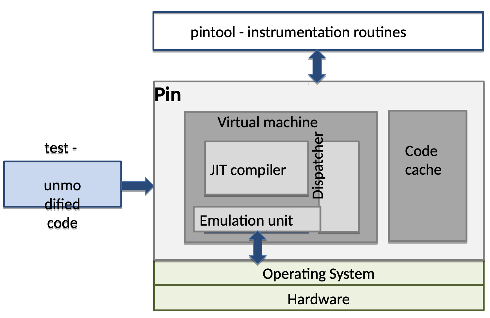

# [Day 13] Coverage-guided fuzzer - 對 binary-only 程式做模糊測試 - Dynamic binary instrumentation (上)


今天會介紹使用 fuzzer 如何使用 Intel Pin 與 QEMU 在動態期間做插樁，藉此取得程式執行的 coverage。


### Dynamic binary instrumentation

#### QEMU

QEMU 是一個用來模擬程式執行的程式，大多應用在測試程式執行，或者是執行不同指令集的程式，實際上又分成 full system emulation 跟 user-mode emulation，前者為包含作業系統執行的模擬，後者只是單純模擬程式的執行。QEMU 的 codebase 很大，並且由多個 components 所組成，因此沒辦法做很詳細的介紹，不過大致上的流程為：

1. 初始化 - 像是記憶體管理等等一定會使用到的服務，必須在執行程式之前就做初始化
2. 處理執行檔 - 讀入使用者指定的執行檔、parse metadata
3. 模擬執行 - QEMU 提供多種模擬方式，不過基本上都很複雜。最直觀的模擬方法為：一行行抓出 instruction，看 instruction 的 mnemonic 為何 (e.g. `add`, `sub`)，執行對應的 handler，記錄執行結果，執行下一個 instruction

---

AFL 的 binary-only 模式底層就是用 QEMU emulator 實作，不過 QEMU 預設是不會紀錄 coverage，因此會需要修改 QEMU 的原始碼來做到這件事，patch 的 diff 在 [AFL repo qemu_mode/patches](https://github.com/google/AFL/tree/master/qemu_mode/patches) 底下，這邊會簡單介紹 patch 更動了哪些地方。


有一些 diff 檔案的內容就只是做一些初始化與設定而已，用簡單的文字來敘述即可：

- syscall.diff - 更新在 kill 時的處理，確保送 `SIGABRT` 時 forkserver thread 會接收到
- configure.diff / memfd.diff - 使用 memory mapping 而不是 memory fd
- elfload.diff - 在 parsing 執行檔的 metadata 時，會初始化 `afl_start_code` 以及 `afl_end_code`，代表要被蒐集 coverage 的程式碼位址的開頭與結尾，`afl_entry_point` 則是紀錄程式的第一個入口


**cpu-exec.diff** ：

```diff
--- qemu-2.10.0-rc3-clean/accel/tcg/cpu-exec.c	2017-08-15 11:39:41.000000000 -0700
+++ qemu-2.10.0-rc3/accel/tcg/cpu-exec.c	2017-08-22 14:34:55.868730680 -0700
@@ -36,6 +36,8 @@
 #include "sysemu/cpus.h"
 #include "sysemu/replay.h"
 
+#include "../patches/afl-qemu-cpu-inl.h"

 typedef struct SyncClocks {
@@ -144,6 +146,8 @@
     int tb_exit;
     uint8_t *tb_ptr = itb->tc_ptr;
 
+    AFL_QEMU_CPU_SNIPPET2;
+
     qemu_log_mask_and_addr(CPU_LOG_EXEC, itb->pc,
                            "Trace %p [%d: " TARGET_FMT_lx "] %s\n",
                            itb->tc_ptr, cpu->cpu_index, itb->pc,
@@ -365,6 +369,7 @@
             if (!tb) {
                 tb = tb_gen_code(cpu, pc, cs_base, flags, 0);
+                AFL_QEMU_CPU_SNIPPET1;
             }
```

- `AFL_QEMU_CPU_SNIPPET2` macro 會在執行到程式碼位址等同於 `afl_entry_point` 時喚醒 fork server，此外還用來記錄新的 coverage
- `AFL_QEMU_CPU_SNIPPET1` macro 會提前通知 QEMU 做 translation，避免 fork 後還要做一次，產生額外的 overhead
  - QEMU translation 會把原本程式的 assembly code 轉為 QEMU 看得懂的形式 (IR)，之後模擬執行時就會比較快


**afl-qemu-cpu-inl.h** 定義 fuzzing 相關的處理，以下擷取比較重要的部分做介紹：

```c
// 通知 tsl (translation handler) 要對指定 basic block 做 translate
#define AFL_QEMU_CPU_SNIPPET1 do { \
    afl_request_tsl(pc, cs_base, flags); \
  } while (0)

// 如果執行到 entry point 就喚起 fork server，
// 並且紀錄 coverage
#define AFL_QEMU_CPU_SNIPPET2 do { \
    if(itb->pc == afl_entry_point) { \
      afl_setup(); \
      afl_forkserver(cpu); \
    } \
    afl_maybe_log(itb->pc); \
  } while (0)

static inline void afl_maybe_log(abi_ulong cur_loc) {

    static __thread abi_ulong prev_loc;
    // 避免紀錄不在 start ~ end 範圍的 coverage
    if (cur_loc > afl_end_code || cur_loc < afl_start_code || !afl_area_ptr)
        return;

    cur_loc  = (cur_loc >> 4) ^ (cur_loc << 8);
    cur_loc &= MAP_SIZE - 1;

	// 透過 probabilistic instrumentation 做優化
    if (cur_loc >= afl_inst_rms) return;
    afl_area_ptr[cur_loc ^ prev_loc]++;
    prev_loc = cur_loc >> 1;
}
```


---

P.S. 由於當初開發時使用的 QEMU 已經過舊，因此在編譯時會遇到一些錯誤，所以讀者想嘗試將 afl qemu mode 跑起來，可以參考這個 [issue](https://github.com/google/AFL/issues/41)，底下的留言有附上修改過的 patch。


#### Intel Pin

Intel Pin 是 Intel 自己推出的 DBI framework，支援 Linux 與 Windows 底下的 x86、x86_64、IA-64 指令集的執行檔。官方已經將其包裝成可以簡單使用的 interface，因此讓開發人員能迅速開發出客製化的動態分析。Intel Pin 使用了 JIT compiler，動態在原本的程式碼中新增插樁程式碼，並在最後執行，整個執行的流程如下 (圖片擷取自文章底部所推薦的投影片)：



其架構就像一個小型的 VM，將餵入的執行檔做處理，並在程式碼中做插樁，最後丟給 JIT compiler 編譯並執行。

> JIT compiler 為 Just-In-Time compiler，程式內本身會執行類似 compiler 的行為，能夠在執行期間產生 assembly code 並執行。

接下來會介紹實際上要怎麼使用 Intel Pin 這個工具。

---

首先到[官網](https://www.intel.com/content/www/us/en/developer/articles/tool/pin-a-binary-instrumentation-tool-downloads.html)下載原始碼，解壓縮後根據檔案 README 執行以下指令做測試：

```bash
cd source/tools/SimpleExamples
# 官方文件是使用 opcodemix.so，
# 不過我認為 malloctrace.so 的實作比較好懂
make obj-intel64/malloctrace.so
# 指定使用 malloctrace.so 此 library 作為工具來分析
../../../pin -t obj-intel64/malloctrace.so -o output -- /bin/ls
```

使用 malloctrace 可以知道在執行到 function `malloc()` 或是 `free()` 時所傳入的參數，並將分析結果存放在檔案 output，內容長得像：

```
malloc(0x1d8)
  returns 0x56337a8422a0
malloc(0x78)
  returns 0x56337a842480
malloc(0x400)
  returns 0x56337a842500
free(0x56337a842480)
free(0x56337a842500)
free(0x56337a8422a0)
free(0)
malloc(0x5)
  returns 0x56337a842910
free(0x56337a842910)
...
```

而 malloctrace.so 的原始碼為 malloctrace.cpp，程式做的事情十分直觀，以下搭配註解做介紹：

```cpp
#include "pin.H"
#include <iostream>
#include <fstream>
using std::cerr;
using std::cout;
using std::endl;
using std::hex;
using std::ios;
using std::string;

// malloc 與 free 的 function name
#define MALLOC "malloc"
#define FREE "free"

// 用於輸出的 file stream
std::ofstream TraceFile;

// 定義參數，格式為：
// (參數模式, 類別名稱, 參數 option, default value, 說明)
KNOB< string > KnobOutputFile(KNOB_MODE_WRITEONCE, "pintool", "o", "malloctrace.out", "specify trace file name");

INT32 Usage()
{
    cerr << "This tool produces a trace of calls to malloc.\n"
            "\n";
    cerr << KNOB_BASE::StringKnobSummary();
    cerr << endl;
    return -1;
}

// ==== 輸出結果時使用到的 function ====
// 印出執行執行 function "name" 時所傳入的參數 "size"
VOID Arg1Before(CHAR* name, ADDRINT size) { TraceFile << name << "(" << size << ")" << endl; }
// 呼叫完後會回到哪個位址
VOID MallocAfter(ADDRINT ret) { TraceFile << "  returns " << ret << endl; }

VOID Image(IMG img, VOID* v)
{
    // 找到 "malloc" instruction Routine
    RTN mallocRtn = RTN_FindByName(img, MALLOC);
    if (RTN_Valid(mallocRtn))
    {
        RTN_Open(mallocRtn); // 開啟 "malloc" routine
        // 在 malloc 執行前 (IPOINT_BEFORE) 執行給定的 function pointer (Arg1Before)
        // 參數傳遞的形式為： TYPE1, VALUE1, TYPE2, VALUE2, ..., IARG_END
        RTN_InsertCall(mallocRtn, IPOINT_BEFORE, (AFUNPTR)Arg1Before, IARG_ADDRINT, MALLOC, IARG_FUNCARG_ENTRYPOINT_VALUE, 0,
                       IARG_END);
        // 在 malloc 執行後 (IPOINT_AFTER) 執行 MallocAfter()
        RTN_InsertCall(mallocRtn, IPOINT_AFTER, (AFUNPTR)MallocAfter, IARG_FUNCRET_EXITPOINT_VALUE, IARG_END);
        RTN_Close(mallocRtn); // 關閉 "malloc" routine
    }
    
    // 找到 "free" instruction Routine
    RTN freeRtn = RTN_FindByName(img, FREE);
    if (RTN_Valid(freeRtn))
    {
        RTN_Open(freeRtn); // 開啟 "free" routine
        // 在 free 執行前執行 Arg1Before()
        RTN_InsertCall(freeRtn, IPOINT_BEFORE, (AFUNPTR)Arg1Before, IARG_ADDRINT, FREE, IARG_FUNCARG_ENTRYPOINT_VALUE, 0,
                       IARG_END);
        RTN_Close(freeRtn); // 關閉 "free" routine
    }
}

// 將 file stream 關閉的 function
// 在 main() 當中會呼叫 PIN_AddFiniFunction() 註冊此
// function 為 fini function
VOID Fini(INT32 code, VOID* v) { TraceFile.close(); }

int main(int argc, char* argv[])
{
    // 初始化 Pin 的 symbol table
    PIN_InitSymbols();

    // 初始化 Pin system
    if (PIN_Init(argc, argv))
        return Usage();

    // 初始化 file stream 與 output format
    TraceFile.open(KnobOutputFile.Value().c_str());
    TraceFile << hex;
    TraceFile.setf(ios::showbase);
    cout << hex;
    cout.setf(ios::showbase);

    // 註冊 callback 處理，當載入 image 時會被呼叫到
    IMG_AddInstrumentFunction(Image, 0);
    
    // 註冊程式結束時會被呼叫的
    PIN_AddFiniFunction(Fini, 0);
    
    // 開始執行指定的 binary
    PIN_StartProgram();

    return 0;
}
```


---

以上即是 QEMU 以及 Intel Pin，兩者都能夠做到在動態執行期間新增程式碼，蒐集 coverage。如果對於 Intel Pin 有興趣，想深入暸解的話，投影片 [Dynamic Analysis: Introduction to dynamic binary instrumentation and Intel Pin](https://cs-uob.github.io/COMSM0049/slides/week4/intro-DynAnalysi-Pin-intro.pdf) 講得非常詳細，讀者可以參考看看。

