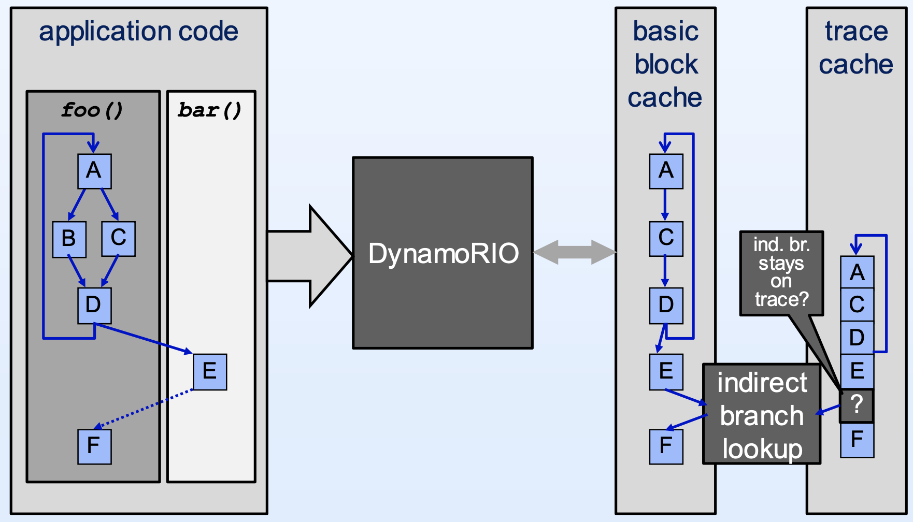

# [Day 14] Coverage-guided fuzzer - 對 binary-only 程式做模糊測試 - Dynamic binary instrumentation (下)


昨天介紹了 AFL 的 QEMU mode 以及 Intel Pin，讓使用者可以在沒有原始碼的情況下蒐集 coverage，今天要介紹的是 Dynamorio，此工具可以說是目前動態插樁綜合評價最好也是最複雜的。

執行環境為 DynamoRIO-Linux-9.0.19244，可以從 repo 上的 [release page](https://github.com/DynamoRIO/dynamorio/releases) 下載，部分資源參考官方的[教學文件](https://dynamorio.org/page_slides.html)。文章 [JackKuo's Blog](https://jackkuo.org/post/dynamorio_introduction/) 對 DynamoRIO 也有做詳細的介紹，如果讀者有興趣可以參考看看。


#### DynamoRIO

DynamoRIO 為支援 Android、Linux 與 Windows 三個平台的 DBI framework，指令集則支援 IA-32、AMD64、ARM 以及 AArch64。DynamoRIO 提供了一些 interface 給開發人員使用，透過這些 interface 可以做到：

- 分析程式行為
- 測量效能
- 插樁
- 優化程式

在 Windows 上並沒有辦法很好的實作插樁與 forkserver 等 \*nix-specific 設計，因此 [WinAFL](https://github.com/googleprojectzero/winafl) (AFL in Windows) 使用了 DynamoRIO 做動態插樁來蒐集 coverage，並且成效很好，也證明了 DynamoRIO 能同時兼具效能與實用。

整個 DynamoRIO 系統與一般的 dynamic binary translation (DBT) 系統相同，讀入 target binary 後做處理，包含 translation、optimization 等等，最後模擬執行。官方提供的運作流程大致如下，：



- DynamoRIO 將原本的程式碼 (application code) 作為 input，分成一個個 basic block 來處理 (`A`, `C`, ...)
- 每個 basic block 會透過執行順序串起來，像是 `A` 會呼叫到 `C`，因此執行完 `A` 後就直接跳到 `C` 執行
- 最後透過一些優化技巧，例如將 basic block cache 起來，常執行到的程式碼就能迅速被取出執行


因為提供的工具與參數太多，以下只會介紹 DynamoRIO 的其中一個工具：**drrun **的使用方法與機制，不過目前其無法在 ubuntu22.04 上執行，細節可以參考此 [issue](https://github.com/DynamoRIO/dynamorio/issues/5437)。

---

**drrun** 可以對執行檔 (application) 做模擬執行，除此之外也能指定執行期間使用特定的插樁處理 (client)，執行流程大致如下：

- Stage 1 - 對原本的程式碼做修改
- Stage 2 - 分析 Stage1 產生出來的程式碼，並將分析結果傳給 Stage3，又稱作 application analysis
- Stage 3 - 基於 Stage2 傳來的分析結果，在先前註冊 component 做插樁，又稱作 instrumentation insertion


用來測試的執行檔 test.c 如下：

```c
// gcc -g -o test test.c
#include <stdio.h>
int main()
{
	puts("OWO");
}
```

編譯後，在 DynamoRIO 的目錄底下執行下列指令，即可透過預設提供的 inscount client 觀察程式執行總共使用到的 instruction 數量：

```bash
# -c: 註冊一個 client
# libinscount.so: 計算總共執行 instruction 數量的 client
./bin64/drrun -c samples/bin64/libinscount.so -- ./test
```

libinscount.so 的原始碼檔名為 inscount.cpp，內容如下：

```c
#include "dr_api.h"
#include "drmgr.h"
#include "droption.h"
#include <string.h>

// 提供額外的參數，舉例來說如果要使用參數 "only_from_app" 的話，執行：
// ./bin64/drrun -c samples/bin64/libinscount.so --only_from_app -- ./test
// 就只會追蹤 application (執行檔) 本身的所執行到的程式碼
static droption_t<bool> only_from_app(
    DROPTION_SCOPE_CLIENT, "only_from_app", false,
    "Only count app, not lib, instructions",
    "Count only instructions in the application itself, ignoring instructions in "
    "shared libraries.");

// counter 變數
static uint64 global_count;
// 此 function 用來增加總共執行的 instruction 次數
static void inscount(uint num_instrs)
{
    global_count += num_instrs;
}

DR_EXPORT void
dr_client_main(client_id_t id, int argc, const char *argv[])
{
	// parse 到 "--" 之前的參數，作為 client 的參數
	droption_parser_t::parse_argv(DROPTION_SCOPE_CLIENT, argc, argv, NULL, NULL);
    // 初始化 dr manager
    drmgr_init();

	// 如果 "only_from_app" option 有設置，會另外處理，不過在此不討論
    if (only_from_app.get_value()) { /* ... */ }

	// 註冊執行結束會被呼叫的 callback function
    dr_register_exit_event(event_exit);
    // 註冊 stage2, 3 的 callback function
    // 參數為：analysis_func, insertion_func, priority
    // analsis_func 即為 application analysis (stage 2)
    // insertion_func 即為 instrumentation insertion (stage 3)
    drmgr_register_bb_instrumentation_event(event_bb_analysis, event_app_instruction, NULL);
}

// 單純執行 dr manager 的 exit function
static void event_exit(void)
{
    drmgr_exit();
}

static dr_emit_flags_t
event_bb_analysis(void *drcontext, void *tag, instrlist_t *bb, bool for_trace,
                  bool translating, void **user_data)
{
    // 計算 basic block 的 instruction 數量
    bool is_emulation = false;
    // 遍歷 basic block 當中的每個 instruction
    for (instr = instrlist_first(bb), num_instrs = 0; instr != NULL;
         instr = instr_get_next(instr)) {
        // instruction 數量++
        num_instrs++;
    }
    // 將 basic block 當中的 instruction 數量存於 user_data 指向的記憶體位址當中
    *user_data = num_instrs;
    return DR_EMIT_DEFAULT;
}

static dr_emit_flags_t
event_app_instruction(void *drcontext, void *tag, instrlist_t *bb, instr_t *instr,
                      bool for_trace, bool translating, void *user_data)
{
    // 此 basic block 的instruction 數量
    num_instrs = user_data;
    // function iscount() 的呼叫會被插樁在 basic block 的第一個 instruction
    dr_insert_clean_call(..., instrlist_first_app(bb), inscount, ..., num_instrs);
    return DR_EMIT_DEFAULT;
}
```

以上述例子來說，流程會像是：

- Stage 1 - 其他 client 需要更動原本的程式碼
- Stage 2 - 分析階段的 callback function `event_bb_analysis()` 會計算每個 basic block 的 instruction 數量
- Stage 3 - 插樁階段的 callback function `event_app_instruction()` 會在每個 basic block 執行之前呼叫 `inscount(num_instrs)`，累加在全域變數 `global_count` 當中

除此之外還有追蹤 syscall 執行的 client、追蹤記憶體使用狀況的 client 等等，都存在於目錄 samples/bin64/lib 底下。


---

此外，**drrun** 的參數 `-t` 則是可以使用內建的多種工具，各工具的 object file 存放於 tools/ 底下，以下列出常見的使用方法：

```bash
# 需要先執行：apt-get install -y libsnappy-dev
# cache simulator
./bin64/drrun -t drcachesim  -- ./test

# 偵測一些 memory 相關的問題，像是未初始化、oob read / write
./bin64/drrun -t drmemory  -- ./test

# 針對特定 function 不斷執行，並整合 drmemory 來偵測記憶體錯誤
./bin64/drrun -t drmemory -batch -fuzz_function main -fuzz_num_iters 10  -- ./test

# 模擬在比較老舊的 CPU 執行的情況
./bin64/drrun -t drcpusim -cpu PentiumPro -- ./test

# 蒐集程式執行的 code coverage 狀態，執行後會產生 .log file
./bin64/drrun -t drcov -- ./test
```


