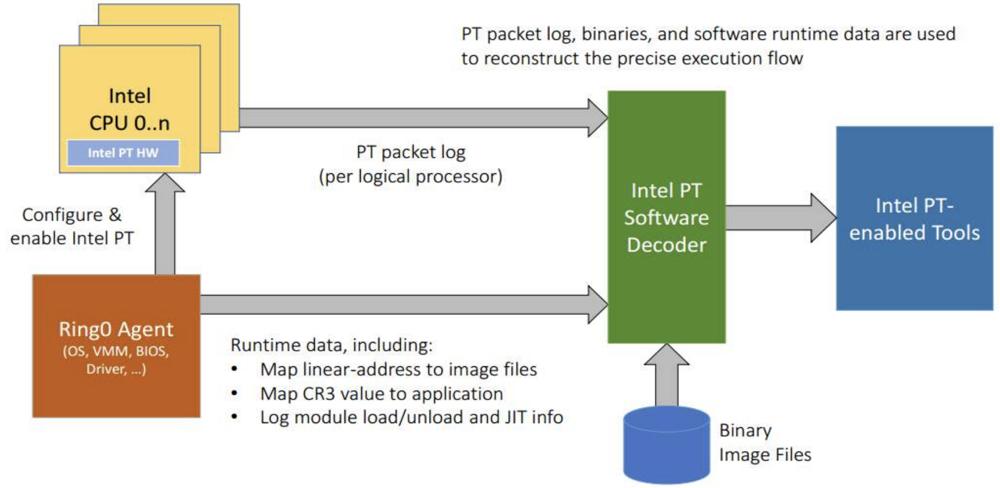

# [Day 15] Coverage-guided fuzzer - 對 binary-only 程式做模糊測試 - Other


前面幾天介紹的幾種對於 binary-only program 做 fuzzing 方法都能夠做大方向的分類，而今天要介紹的方法都不太能分到前面兩種，因此特別拿出來做介紹。


### Other

#### Hardware support

一些指令集提供追蹤程式特定行為的功能，其中也包含 coverage 的資訊，最有名的即是 **Intel Processor Trace (Intel-PT)**，linux 作業系統可以透過 /proc/cpuinfo 檢查是否支援，如果 flags 的欄位中包含 `intel_pt` 字串就代表有。

Intel-PT 除了知道程式執行狀態，還能指定要蒐集的位址範圍，[Intel 手冊](https://www.intel.com/content/dam/www/public/us/en/documents/manuals/64-ia-32-architectures-software-developer-vol-3c-part-3-manual.pdf) 當中有清楚描述  Intel-PT 的使用方式以及原理，這裡大概介紹一下。首先在使用 Intel-PT 前會需要做設定，像是要追蹤的 instruction、追蹤時使用的權限等等，而在執行期間 Intel-PT 會將結果按照格式，放在指定的記憶體位址當中，這些資料被稱作 **packet**，分析這些資料的 component 稱作 **decoder**。

目前 Intel-PT 已經被整合到 perf_events 的 subsystem 當中 ([Adding Processor Trace support to Linux](https://lwn.net/Articles/648154/))，執行框架可以參考 [Go Speed Tracer](https://talos-intelligence-site.s3.amazonaws.com/production/document_files/files/000/000/048/original/Go_Speed_Tracer.pdf) 投影片的內容：



- Ring Agent - 透過 perf interface 在 kernel 設定 Intel-PT 
- Intel CPU 0..n - 產生 PT packet
- Decoder - 分析 PT packet，需要原始檔才能知道正確的記憶體結構


由於是指令集層的支援，因此如果 fuzzer 需要使用 Intel-PT，會將相關處理直接寫在程式碼裡面，不像 DBI 通常直接使用 library 提供的 API，不過 Intel-PT 有一個官方維護的 library，叫做 [libipt](https://github.com/intel/libipt)，主要是提供一些**範例使用方法、測試資料**給開發人員參考，以下會由此 library 提供的三個工具做介紹，分別為：

- **pttc** - 用來測試 trace 的執行結果
- **ptdump** - packet dumper，讀入 Intel PT file (.pt) 並產生 human-readable 格式的 output
- **ptxed** - trace disassembler，用於重建過去的執行流程


---

執行以下指令來建立環境：

```bash
cd ~
# 下載並安裝 Intel X86 Encoder Decoder (Intel XED)
git clone https://github.com/intelxed/xed.git xed
git clone https://github.com/intelxed/mbuild.git mbuild
cd xed
./mfile.py --shared install

cd ~
# 下載 libipt 並建立輸出資料夾
git clone https://github.com/intel/libipt
cd libipt/ && mkdir build && cd build/
# 產生 Makefile，以下需要注意：
# /home/user: 記得改成自己使用者的加目錄
# xed-install-base-2022-09-17-lin-x86-64: 會根據版本不同而有不同檔名
cmake -DXED_INCLUDE=/home/user/xed/kits/xed-install-base-2022-09-17-lin-x86-64/include/xed -DXED_LIBDIR=/home/user/xed/kits/xed-install-base-2022-09-17-lin-x86-64/lib -DPTTC=ON -DPTDUMP=ON -DPTXED=ON ..
# 產生執行檔
make
```

最後會在 libipt/build/bin 目錄底下產生三個執行檔： pttc、ptdump 與 ptxed。

pttc 能夠根據 .ptt (pt testing) 檔來模擬執行：

```bash
./pttc ~/libipt/test/src/loop-tnt.ptt
```

loop-tnt.ptt 的檔案內容：

```assembly
; Test a simple for loop
;

org 0x100000
bits 64

; @pt p1: psb()
; @pt p2: fup(3: %l1)
; @pt p3: mode.exec(64bit)
; @pt p4: psbend()

l1:     mov rax, 0x0
l2:     jmp l4
l3:     add rax, 0x1
l4:     cmp rax, 0x1
l5:     jle l3
; @pt p5: tnt(t.t.n)
; @pt p6: fup(3: %l6)
; @pt p7: tip.pgd(0: 0)
l6:     leave


; @pt .exp(ptdump)
;%0p1  psb
;%0p2  fup        3: %0l1
;%0p3  mode.exec  cs.l
;%0p4  psbend
;%0p5  tnt.8      !!.
;%0p6  fup        3: %0l6
;%0p7  tip.pgd    0: ????????????????


; @pt .exp(ptxed)
;%0l1 # mov rax, 0x0
;%0l2 # jmp l4
;%0l4 # cmp rax, 0x1
;%0l5 # jle l3
;%0l3 # add rax, 0x1
;%0l4 # cmp rax, 0x1
;%0l5 # jle l3
;%0l3 # add rax, 0x1
;%0l4 # cmp rax, 0x1
;%0l5 # jle l3
;[disabled]
```

- pttc 的 parser 會處理包含 `@pt` directive marker 的註解
  - 看到 `@pt .exp(<tool>)` directive 就會嘗試模擬 tool 輸出結果，並產生副檔名為 .exp 的檔案
  - 看到 ` @pt p{1,2,3,...}: ` 則代表要產生對應的 trace packet，最終會儲存到 .pt 檔
- `%0{p,l}NUMBER` 格式代表對應 label 的 address

其中使用到的 packet 一共有六種：

- psb (Packet Stream Boundary) - 每產生一定大小的資料就會產生的 heartbeat packet
- fup (Flow Update Packets) - 通知發生 async event
- mode.exec - 提供 decoder 當前的執行模式
- psbend - 作為一連串的 psb 的終止通知
- tnt - 紀錄 conditional branch 最後往哪邊走
- tip - 紀錄更新後的 target IP
  - pgd (Packet Generation Disable) - 不再產生任何 packet


由此可知，在執行程式前就已經接收到一些設定相關的 packet (mode.exec, ...)，而在執行的過程中會收到一個表示 branch taken 兩次與 branch non-taken 一次的 packet (tnt !!.)，最後接收到不再產生 packet 的通知 (tip.pgd)。


---

執行結束後會輸出下面檔案：

- 由 yasm 產生的檔案
  - loop-tnt.lst -  assembly listing file，能夠精確地紀錄 assembler 怎麼把 assembly code 轉成 machine code
  - loop-tnt.bin - raw binary file
- loop-tnt.pt - Intel PT file
- loop-tnt-ptxed.exp - 預期 ptxed 輸出
- loop-tnt-ptdump.exp - 預期 ptdump 輸出

工具 ptdump 的重現結果：

```bash
./ptdump loop-tnt.pt
0000000000000000  psb
0000000000000010  fup        3: 0000000000100000
0000000000000017  mode.exec  cs.l
0000000000000019  psbend
000000000000001b  tnt.8      !!.
000000000000001c  fup        3: 0000000000100013
0000000000000023  tip.pgd    0: ????????????????
```

工具 ptxed 的重現結果：

```bash
# --pt 指定 trace file
# --raw 指定 binary file 以及載入的位址
./ptxed --pt loop-tnt.pt --raw loop-tnt.bin:0x100000
0000000000100000  mov rax, 0x0
0000000000100007  jmp 0x10000d
000000000010000d  cmp rax, 0x1
0000000000100011  jle 0x100009
0000000000100009  add rax, 0x1
000000000010000d  cmp rax, 0x1
0000000000100011  jle 0x100009
0000000000100009  add rax, 0x1
000000000010000d  cmp rax, 0x1
0000000000100011  jle 0x100009
```

基本上與預測的輸出結果相同。


---


如果要自己寫 Intel-PT 的處理，可以透過 syscall **perf_event_open** 註冊 Intel-PT event，並透過 memory mapping 取得 packet buffer 位址，buffer 根據需求可以為 circular 或是 linear，後續即可直接透過 memory 做存取。buffer 一共分成 AUX 與 DATA 兩種：

- AUX - 唯讀，存放 trace 結果
- DATA - 唯寫，存放資料更動 (?) 的資訊 (sideband information)


---

投影片 [Go Speed Tracer](https://talos-intelligence-site.s3.amazonaws.com/production/document_files/files/000/000/048/original/Go_Speed_Tracer.pdf) 從 P.47 開始會介紹 Intel-PT，包含使用的資料結構與暫存器位址，而 P.47 前也大概介紹了一些 fuzzing 的相關知識，有興趣的讀者可以看看。


#### ptrace

ptrace 是 linux 上的一個 system call 名稱，能讓 parent process 觀察 child process 的執行狀態，並且能使用不同的參數來修改/讀取/控制 child process 的執行流程與記憶體資源，原生的 gdb debugger 底層就是 ptrace 實作。

在 x64 上的 ptrace 實作原理是透過加上 instruction **int3** 觸發 interrupt，在 kernel 中會檢查目前的程式 (debuggee) 是否正在被其他的程式 (debugger) debug，如果是就暫停執行，等待 debugger 的處理。舉例來說，下方為 debuggee 會執行到的程式碼片段：

```assembly
55         push   rbp
48 89 e5   mov    rbp,rsp
53         push   rbx
```

如果希望觀察執行 instruction `push rbx` 前的暫存器狀態，就可以將該 instruction 改成 `int3`：

```assembly
55         push   rbp
48 89 e5   mov    rbp,rsp
cc         int3
```

而後 debuggee 執行 0xcc (`int3`) 而觸發 interrupt，暫停執行並等待 debugger 的命令。Debugger 會在下次 debuggee 執行前把 `int3` 改回 `push rbx`，這樣 debuggee 就能正常執行。


如果透過 ptrace 取得程式執行的 coverage，就需要先將目標程式當中的每個 basic block 開頭改成 `int3`，執行期間目標程式就是 debuggee，原本 fuzzer 就會多了一個 debugger 的身份。當目標程式執行到 `int3` 觸發 interrupt，fuzzer 就能夠知道目標程式目前執行到的位址，紀錄 coverage 後在通知目標程式繼續執行。


#### Signal handler

Signal handler 在處理 `int3` 時與 ptrace 的機制十分相似，不過在收到 interrupt 後，前者產生 signal `SIGTRAP` ，交給指定的 signal handler 處理，後者則是暫停執行，等待 debugger 處理。Signal handler 能知道觸發 signal 時的 program counter (PC)，紀錄完在從 signal handler 回到原本的執行流程。

雖然 `SIGTRAP` 之外的 signal 也能處理，不過 instruction `int3` 的長度為 1，不太會受到長度限制，因此為首選，如果要產生其他的 signal 會需要多個 instruction，在短一點 function 可能就出問題。

Signal handler 的使用方式十分簡單，下方提供基本的範例：

```c
static void signal_handler(int signo, siginfo_t *si, void* arg)
{
	greg_t *gregs = (greg_t *)&((ucontext_t *) arg)->uc_mcontext.gregs;
    // rip 即為發生 signal 時的記憶體位址
    long rip = gregs[REG_RIP];
	// 透過 rip 來紀錄 coverage
    // ...
}

__attribute__ ((constructor))
void register()
{
    // 註冊 SIGTRAP 的 signal handler
	action.sa_flags = SA_SIGINFO;
    action.sa_sigaction = signal_handler;
    sigaction(SIGTRAP, &action, NULL);
}
```

此種方法必須在執行目標程式前就註冊好 signal handler，因此通常會編譯成 shared library，並將註冊的 function 加上屬性 `__attribute__((constructor))`，再透過 `LD_PRELOAD` 載入此 library，這樣 linker 在執行每個 library 的 constructor 時就會註冊到 signal handler。


### 總結

這幾天介紹了在有/沒有 source code 的情況下取得程式 coverage 的方法，包含了一般的插樁、靜態分析改變執行流程、動態執行做額外處理，最後還介紹一些特殊的方法。當有了蒐集 coverage 的方法後，該如何讓程式走到更多的 coverage，或是增加 coverage 的品質，這將會在接下來幾天做介紹。

