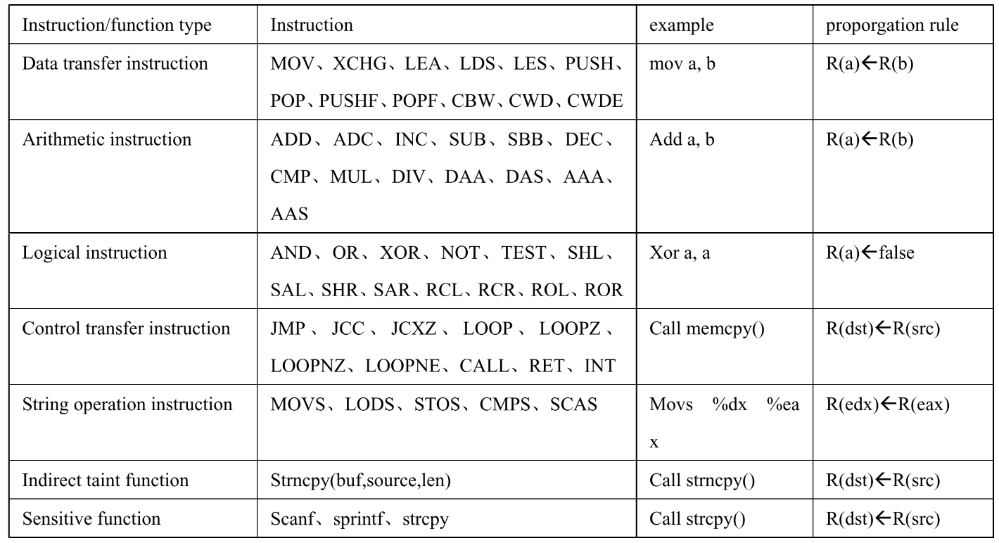
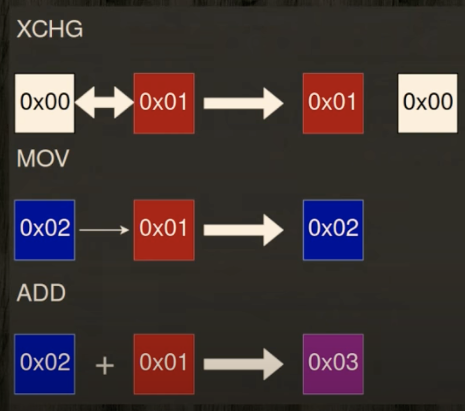

# [Day 16] 優化找 coverage 的能力 - 污點分析 Taint analysis


這兩天主要會介紹**污點分析 (taint analysis)** 跟**符號執行 (symbolic execution)**，前者可以知道資料的走向並作分析，後者可以算出如果要走到特定的 function，輸入需要滿足怎樣的條件。當這兩個技術運用在 fuzzing 當中，fuzzer 就能走到條件比較嚴苛的 function，藉此增加程式 coverage，或者就只需要針對輸入中比較有興趣的資料做 mutation。


### Taint analysis

Taint analysis 中文翻譯為污點分析，是一種 data flow tracking 的技巧，通常被用來檢測惡意的資料流向，藉此得知程式當中哪些地方可能會發生問題。

Taint analysis 會使用專有名詞來描述資料的用途，以下為常見的名詞：

- Source - 要追蹤的資料與追蹤的開始位置，資料像是使用者輸入或是私人的資料，而位置像是某個 function call 或是程式的入口點
- Propagation - source 的流向，其他被影響 (taint) 到的資料，又稱作 polluted
- Sink - 檢查 taint 的地方，取決於開發人員的目的，像如果想看 source data 是否會被印出來，也許會在呼叫 write system call 時檢查

Instruction 也根據功能分成不同的 type 與 propagation rule (圖片擷取自 conference talk [A Review of Researching on Dynamic Taint Analysis Technique](https://www.atlantis-press.com/proceedings/jimec-18/55911377))：



其中比較特別的是 logical instruction 的 rule `R(a) <- False`，代表 `a` 因為被清空所以不再被 taint，其他分類在 logical instruction 也能做到類似的行為。


通常做 taint analysis 會搭配 DBT (dynamic binary translation)，因為需要在程式執行期間做額外的處理，其實也可以將其視為一種負責檢查記憶體的插樁，不過當然也有靜態做 taint analysis 的方式，像是 [SelectiveTaint](https://www.usenix.org/conference/usenixsecurity21/presentation/chen-sanchuan) 就使用了 static binary writing 的技巧。

Taint analysis 的用途很廣泛，實作方法也很多種，舉例來說 [libdft](https://github.com/AngoraFuzzer/libdft64) (Dynamic data flow tracking, DFT) 就是建立在 Intel Pin 上做插樁，並使用 shadow memory 實作 tracking 的 DFT framework，此篇文章參考了主要維護者在 [conference 上的演講](https://www.youtube.com/watch?v=ERJnLYn7M5I)，以 libdft 來介紹 DFT 的實作。

---


看過 Day3 - AddressSanitizer 的讀者應該會對 shadow memeory 不陌生，而 libdft 也使用了這個技巧，為主要的記憶體建立一個 shadow memory 作為 bitmap，而這個 bitmap 就用來表示原本記憶體的使用狀態，每個 bit 的定義可以自行決定。

Conference 中舉了三個例子，`xchg` 代表資料的交換，因此狀態 00 跟 01 的資料會互相交換；`mov` 則會直接將資料的狀態覆蓋掉，也就把 01 覆蓋成 02；`add` 則會結合兩個資料的狀態，也就是 01 + 02 == 03。




這個做法的好處在不同的 bit 可以自己決定意義，如果研究員希望能有更細粒度的分析，像是了解記憶體是在程式的哪個 component 被修改，就可以使用不同的 bit value 來表示不同的 component，舉例來說，bitmap 若為 0b0100 則代表在 network 相關的操作被修改，若為 0b1000 則在處理檔案時被做修改，最後在 sink 時就能根據這些值對應的意義做處理。

---


建立執行 libdft 的環境：

```bash
git clone https://github.com/AngoraFuzzer/libdft64.git
# Intel Pin 存放在 build
cd libdft64 && mkdir build
PREFIX=/home/user/libdft64/build ./install_pin.sh
# build libdft64
make
# 編譯完後，跑跑看測試執行檔
# pin-3.20-98437-gf02b61307-gcc-linux 目錄名稱會根據你下載的版本與時間有差，
# 因此要自行修改
cd tools
/home/user/libdft64/build/pin-3.20-98437-gf02b61307-gcc-linux/pin -t obj-intel64/track.so -- obj-intel64/mini_test.exe cur_input
```

track.so 為 libdft 根據 Intel Pin 提供的 API 所撰寫的 taint analysis library，mini_test.exe 是用來測試的執行檔，是一個副檔名為 .exe的 ELF。因為 mini_test.exe 可以執行，因此可以藉由比對有/沒有使用工具 track.so 的輸出結果，來了解 track.so 做了哪些事情：

```
$ obj-intel64/mini_test.exe cur_input
set: 0x7ffecd8c8c88, 8
get: 0x7ffecd8c8c88
getval: 0
get: 0x7ffecd8c8c86
get: 0x7ffecd8c8c86
getval: 30496
getval: 30498

$ pin -t obj-intel64/track.so -- obj-intel64/mini_test.exe cur_input
...
[PIN][SET] addr: 0x7ffe299c8d00, lb: 17, taint: 8
set: 0x7ffe299c8d00, 8
[PIN][GET] addr: 0x7ffe299c8d00, v: 0, lb: 17, taint: {(8, 9) }
get: 0x7ffe299c8d00
[PIN][GETVAL] v: 0, lb: 17, taint: {(8, 9) }
getval: 0
[PIN][GET] addr: 0x7ffe299c8d08, v: 0, lb: 0, taint: {}
get: 0x7ffe299c8d08
[PIN][GET] addr: 0x7ffe299c8d08, v: 30496, lb: 110, taint: {(5, 6) (6, 7) }
get: 0x7ffe299c8d08
[PIN][GETVAL] v: 30496, lb: 110, taint: {(5, 6) (6, 7) }
getval: 30496
[PIN][GETVAL] v: 30498, lb: 110, taint: {(5, 6) (6, 7) }
getval: 30498
```

測試程式 mini_test.cpp 將檔案讀入後，穿插了許多 set/get 的操作，我有稍微對 `main()` 做修改，避免輸出的結果造成使用者混淆：

```cpp
extern "C" {
    void __attribute__((noinline)) __libdft_set_taint(void *p, unsigned int v) {
        printf("set: %p, %d\n", p, v);
    }
    void __attribute__((noinline)) __libdft_get_taint(void *p) {
        printf("get: %p\n", p);
    }
    void __attribute__((noinline)) __libdft_getval_taint(uint64_t v) {
        printf("getval: %lu\n", v);
    }
}

int main(int argc, char **argv) {
    fp = fopen(argv[1], "rb");
    // 底層的 read syscall 會自動將 buf 做 taint
    ret = fread(buf, sizeof *buf, 20, fp);
    fclose(fp);

    uint64_t m = 0;
   	// 標記 &m + 8 的位址為 taint
    __libdft_set_taint(&m, 8);
    __libdft_get_taint(&m);
    __libdft_getval_taint(m);
	
    // *** 原本的 source code 中為 uint16_t，但我認為 uint64_t 比較清楚 ***
    uint64_t x = 0;
    __libdft_get_taint(&x);
    // 由於 buf 為 taint，因此在複製後 x 也被 taint
    memcpy(&x, buf + 5, 2);
    __libdft_get_taint(&x);
    __libdft_getval_taint(x);
    
    uint64_t y = x + 2;
    __libdft_getval_taint(y); // y 也被 taint
}
```

工具 track.cpp 會在指定的 function 被呼叫時產生 source / sink：

```cpp
// 建立 sink
VOID TestGetHandler(void *p) {
    uint64_t v = *((uint64_t *)p);
    tag_t t = tagmap_getn(p, 8);
    printf("[PIN][GET] addr: %p, v: %lu, lb: %d, taint: %s\n", p, v, t,
           tag_sprint(t).c_str());
}
VOID TestGetValHandler(THREADID tid, uint64_t v) {
    tag_t t = tagmap_getn_reg(tid, X64_ARG0_REG, 8);
    printf("[PIN][GETVAL] v: %lu, lb: %d, taint: %s\n", v, t,
           tag_sprint(t).c_str());
}
// -------------------------------------------
// 建立 sources
VOID TestSetHandler(void *p, unsigned int v) {
    // tag 傳進來的參數，代表已經被 taint
    tag_t t = tag_alloc<tag_t>(v);
    tagmap_setb(p, t);
    printf("[PIN][SET] addr: %p, lb: %d, taint: %d\n", p, t, v);
}

// 以下省略 valid check 以及 open / close 操作
VOID EntryPoint(VOID *v) {
    // traverse 所有 image (binary file)
    for (IMG img = APP_ImgHead(); IMG_Valid(img); img = IMG_Next(img)) {
        // 以 function name 搜尋 routine object
        
        // 呼叫 __libdft_get_taint(p) 前會執行 TestGetHandler(p)
        RTN test_get_rtn = RTN_FindByName(img, "__libdft_get_taint");
        RTN_InsertCall(test_get_rtn, IPOINT_BEFORE, (AFUNPTR)TestGetHandler, ...);

        // 呼叫 __libdft_set_taint(p,v) 前會執行 TestSetHandler(p,v)
        RTN test_set_rtn = RTN_FindByName(img, "__libdft_set_taint");
        RTN_InsertCall(test_set_rtn, IPOINT_BEFORE, (AFUNPTR)TestSetHandler, ...);

        // 呼叫 __libdft_getval_taint(v) 前會執行 TestGetValHandler(thread_id,v)
        RTN test_getval_rtn = RTN_FindByName(img, "__libdft_getval_taint");
        RTN_InsertCall(test_getval_rtn, IPOINT_BEFORE, (AFUNPTR)TestGetValHandler, ...);
    }
}

int main(int argc, char *argv[]) {
    PIN_InitSymbols(); // 初始化 symbol table
    PIN_Init(argc, argv); // 初始化參數
	libdft_init(); // 初始化 libdft library
    // 在 pin 初始化後會執行 Entry
    PIN_AddApplicationStartFunction(EntryPoint, 0);
	// libdft 會 hook 在與 file 相關的 syscall，
    // 並將 syscall 參數標記成 taint
    hook_file_syscall();
    PIN_StartProgram(); // 開始執行
    return 0;
}
```

雖然 libdft 並非主流的 DFT framework，程式碼中也沒有良好的註解可以參考，不過單就介紹執行流程與使用方法來說已經綽綽有餘。


---

CMU 的課程投影片有介紹到 taint analysis [Foundations of Software Engineering](https://www.cs.cmu.edu/~ckaestne/15313/2018/20181023-taint-analysis.pdf)，內容包含 static 與 dynamic taint analysis 的原理，有興趣的讀者可以參考看看。

