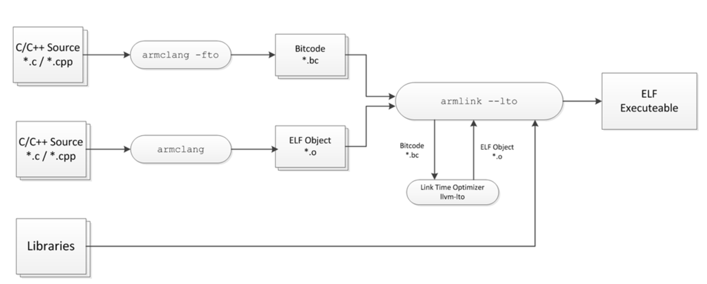

# [Day 18] 優化找 coverage 的能力 - 鏈結時期優化 (LTO)


Link time optimization (LTO) 的功能如同他的名字 (self-explanatory)，就是在將各個 object file 鏈結起來前再做一次優化，而如果沒有使用 LTO 的話，編譯器就只會對各個檔案分別最佳化。

透過 LTO 能加強 fuzzer 的效率，舉例來說 fuzzer [AFL++](https://github.com/AFLplusplus/AFLplusplus) 透過 LTO 做到避免執行期間產生的 edge value 出現碰撞的情況，也就是 **collision-free** instrumentation ([文件](https://github.com/AFLplusplus/AFLplusplus/blob/stable/instrumentation/README.lto.md))，結果顯示提升了 10-25% 的執行效率。

文件 [Link Time Optimization in ARM Compiler 6](https://community.arm.com/arm-community-blogs/b/tools-software-ides-blog/posts/link-time-optimization-in-arm-compiler-6) 中有對 LTO 做完整的說明，接下來的文章中也參考了此文件的資源，有興趣的讀者可以在自行閱讀。


### LTO workflow

LTO 在整個編譯流程的哪個部分，能從下圖清楚了解：



1. Souce code 會透過 clang compiler 轉成中間碼 (intermediate representation, IR)，也稱作 bitcode
2. 鏈結器 (linker) 會從產生的 bitcode 與其他 object file 分析出彼此的 dependencies，並交給 LTO 做優化
3. 優化過程中會將沒使用到的 object file 或是程式碼給移除，最後產生新的 object file。如果需要有客製化的優化處理，可以額外寫 plugin
4. 最後 linker 會在將這些 object file 組起來，產生可執行的 ELF file


以 [llvm 官方文件](https://llvm.org/docs/LinkTimeOptimization.html#example-of-link-time-optimization) 提供的範例程式碼為例，能更了解 LTO 實際上做了哪些優化：

```c
// --- a.h ---
extern int foo1(void);
extern void foo2(void);
extern void foo4(void);

// --- a.c ---
#include "a.h"

static signed int i = 0;

void foo2(void) {
    i = -1;
}

static int foo3() {
    foo4();
    return 10;
}

int foo1(void) {
    int data = 0;

    if (i < 0)
        data = foo3();

    data = data + 42;
    return data;
}

// --- main.c ---
#include <stdio.h>
#include "a.h"

void foo4(void){
    printf("Hi\n");
}

int main() {
    return foo1();
}
```

分析這三個檔案 (main.c, a.c, a.h)，可以發現一些架構上的問題：

- main.c
  - 雖然 include a.h，但實際上外部 function 只有使用 `foo1()`
  - 定義的 function `foo4()` 沒有被使用到
- a.c
  - 變數 `i` 預設為 0，雖然可以透過 function `foo2()` 賦值 -1，不過程式並沒有呼叫 `foo2()`，因此 `i` 值恆為 0
  - 承接上一個問題的結果，function `foo3()` 也不可能被呼叫到 (需滿足 `i < 0`)
- 總結來說，實際使用的 function 只有 `foo1()`，並且 `i` 值為 0，其他的 function 與 condition 都是多餘的

如果編譯時使用 LTO，就可以把這些沒有使用到的 function 移除，優化執行檔的大小。下方為編譯時使用 LTO 所需要傳入的參數：

```bash
# -flto 會輸出 bitcode 格式的 object file
clang -flto -c a.c -o a.o

# 兩者擇一，如果不加 flto 就會產生 ELF format 的 object file
clang -flto -c main.c -o main.o
clang -c main.c -o main.o

# 處理 bitcode / ELF 並做 LTO，最後產生 main 執行檔
clang -flto a.o main.o -o main
```

最後透過 objdump 看執行檔 main，會發現使用者撰寫的程式碼只留下 `main()` 與 `foo1()`，並且在 `foo1()` 對於 `i` 的檢查也被優化掉了：

```
0000000000001130 <foo1>:
    1130:       55                      push   rbp
    1131:       48 89 e5                mov    rbp,rsp
    1134:       c7 45 fc 00 00 00 00    mov    DWORD PTR [rbp-0x4],0x0
    113b:       8b 45 fc                mov    eax,DWORD PTR [rbp-0x4]
    113e:       83 c0 2a                add    eax,0x2a
    1141:       89 45 fc                mov    DWORD PTR [rbp-0x4],eax
    1144:       8b 45 fc                mov    eax,DWORD PTR [rbp-0x4]
    1147:       5d                      pop    rbp
    1148:       c3                      ret

0000000000001150 <main>:
    1150:       55                      push   rbp
    1151:       48 89 e5                mov    rbp,rsp
    1154:       48 83 ec 10             sub    rsp,0x10
    1158:       c7 45 fc 00 00 00 00    mov    DWORD PTR [rbp-0x4],0x0
    115f:       e8 cc ff ff ff          call   1130 <foo1>
    1164:       48 83 c4 10             add    rsp,0x10
    1168:       5d                      pop    rbp
    1169:       c3                      ret
```

如果把參數 `-flto` 移除，代表不做 LTO，則執行檔 main 會包含許多用不到的程式碼：

```
0000000000001140 <foo4>:
    1140:       55                      push   rbp
	...
    114d:       e8 de fe ff ff          call   1030 <printf@plt>
    ...

0000000000001160 <main>:
	...
    116f:       e8 1c 00 00 00          call   1190 <foo1>
    ...
    1179:       c3                      ret

0000000000001180 <foo2>:
    1180:       55                      push   rbp
    ...
    118f:       c3                      ret
```


### LTO in fuzzing

Edge collision，又稱作 path collision，指的是不同的兩組 basic block 組合產生了相同的 edge value，如果參考 AFL 算 edge value 的方法，可以想成發生 `bb_id(bb_a) ^ bb_id(bb_b)` 等同於 `bb_id(bb_c) ^ bb_id(bb_d)` 的情況 (bb 為 basic block 縮寫)，這樣會讓 fuzzer 認為這兩個不同的 path 是同一個，以至於漏失許多走到新 path 的情況。

Basic block ID 在編譯時期就已經決定好，因此如果要避免這種情況發生，就必須在編譯的流程中處理，因此論文 [CollAFL: Path Sensitive Fuzzing](https://ieeexplore.ieee.org/document/8418631) 不僅發現這個情況發生的比想像中頻繁，造成效能的下降，同時也提出透過在 clang LTO pass 實作相關演算法來處理這個問題，而類似的機制後來在 AFL++ 也有實作，不過我不確定兩者之間的關聯，AFL++ 的 LTO 處理可以參考原始碼 [SanitizerCoverageLTO.so.cc](https://github.com/AFLplusplus/AFLplusplus/blob/stable/instrumentation/SanitizerCoverageLTO.so.cc)。
