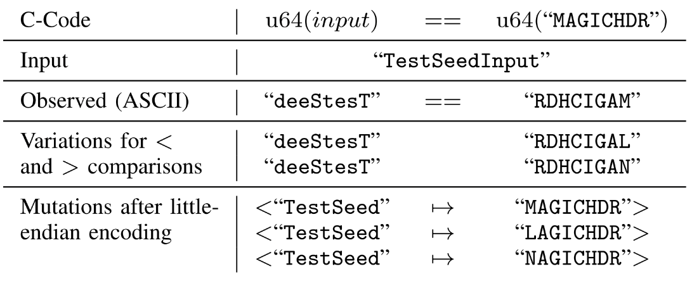

# [Day 19] 優化找 coverage 的能力 - REDQUEEN


**校驗碼 (checksum)** 被用來檢測資料的完整性，**魔術數字 (magic number)** 被用來偵測特定格式的資料，當這兩種類型的檢查出現在程式當中，會讓總是產生隨機資料的 fuzzer 沒辦法走到更深的地方。舉例來說，如果程式只支援 ELF 檔案格式，則在程式的一開始就會檢查檔案的合法性，否則就直接不處理，因此 fuzzer 產生的 input 必須含有 ELF magic number，才能走到檢查之後的程式邏輯，例如以下範例程式，當檔案開頭不為 ELF magic number 時，永遠只能走到程式的開頭：

```c
fd = open("./input", O_RDONLY);
read(fd, buf, 0x4);
// 7f 'E' 'L' 'F' 是 ELF file 的 magic number
if (buf[0] != 0x7f || buf[1] != 0x45 || buf[2] != 0x4c || buf[3] == 0x46)
    exit(1);
// 幾千幾萬行的程式碼
// ...
```

Checksum 則是用來看資料在傳輸的過程中是否有遺失，經常被用在網路傳輸，而通常這部分的程式碼在一開始就會先確保資料完整，才會執行後面的操作，例如以下範例程式，如果求出來的 checksum 與封包中所記錄的不相同，程式就會直接終止：

```c
recv(sock_fd, &pkt, 0x100, ...);
calc_checksum = crc32(&pkt.data);
if (calc_checksum != pkt.checksum)
    exit(1);
// 幾千幾萬行的程式碼
// ...
```

---


[Redqueen: Fuzzing with Input-to-State Correspondence](https://www.ndss-symposium.org/ndss-paper/redqueen-fuzzing-with-input-to-state-correspondence/) 發表於 NDSS 2019，提出了直觀的做法解決當時 fuzzer 無法處理 checksum 與 magic number 的問題，並且在沒有使用 symbolic execution 與 taint analysis 的情況下做到部分的執行流程分析，成功讓優化 coverage 的領域往前了一大步。

這篇在近期 fuzzing 相關的論文中應該算是很經典的，不少論文的優化方法都是從 REDQUEEN 取得靈感，同時他提出的方法也跟 Day16 Day17 介紹的優化方法有關係。相關資源都存放在 [REDQUEEN github repo](https://github.com/RUB-SysSec/redqueen)，包含演講影片、投影片與論文連結等等，有興趣的讀者可以自行閱讀，接下來會介紹論文所提出的問題以及解決方法，同時也會跟先前介紹的方法做個比較。


## REDQUEEN

透過觀察，研究人員發現 fuzzer 執行不到的程式碼大多具有 magic number 或是 checksum 的檢查，下方的程式碼清楚說明這兩種情況的發生：

```c
// 魔術數字的比對，magic number
if(u64(input) == u64("MAGICHDR"))
    bug(1);

// 校驗碼的檢查，checksum
if(u64(input) == sum(input+8, len-8))
    if(u64(input+8) == sum(input+16, len-16))
        if(input[16] == 'R' && input[17] == 'Q')
            bug(2);
```

這種檢查讓隨機化產生資料的 fuzzer 沒辦法繼續執行，然而如果想要走到 `bug(1)` 或是 `bug(2)` 的話，雖然可以利用 taint analysis 與 symbolic execution 產生對應的 input，但實際情況會面臨兩個問題：

- 我們並不能知道實際程式當中的 `bug()` 在哪裡
- 大量的條件判斷會讓 overhead 過大

因此這並非一個有效的解法。而研究人員觀察到程式在大多數的情況，多少會將輸入存放在記憶體或是暫存器當中，於是他們提出 **input-to-state** 的概念與 **colorizing** 的機制，將**特定部分的輸入**取代成 magic number，藉此繞過 magic number 的檢查，並且實作出一個 **patching-based** 的解決方法處理 checksum 的比對。


### Bypass magic number check

REDQUEEN 會執行下面的處理：

- **Tracing** - 以當前的 input 執行一次程式，並 hook 所有比較相關的操作，像是 instruction `cmp` 或是字串比較 function `strcmp()`，同時將參數抽取出來
- **Variants** - 對要被比較的值做些微的改動，像是 +1 或 -1，用來區別不同的比較操作
- **Encoding** - 模擬 input 到達比較之前做了哪些處理，像是變成以小端來處理
- **Application** - 使用格式為 `<pattern → repl>` 的 mutation，將 `pattern` 的部分直接換成 `repl`
- **Colorization** - 增加 input 當中隨機 byte 的個數，避免子字串重複出現

論文中以一開始介紹 magic number 與 checksum 檢查的程式碼為例子，將上述提到的處理做對應：



- **Tracing** - 以 `"TestSeedInput"` 作為程式輸入，並且 hook 在比較程式碼 `u64(input) == u64("MAGICHDR")`，而因為比較時使用整數型態，因此實際上值應該等於 `"deeStesT"`
- **Variants** - `u64("MAGICHDR")` 轉成整數型態並 +1 會得到 `"RDHCIGAN"`，而 -1 得到 `"RDHCIGAL"`，於是會有三種不同的比較值：`"RDHCIGAN"` (+1)、`"RDHCIGAM"` (0)、`"RDHCIGAL"` (-1)
- **Encoding & Application** - 將這些整數值做了小端編碼，並將對 input 當中 `"TestSeed"` 的部分替換成經過 mutate 的 magic number
- **Colorization** - 讓 input 盡量長得像 `"TestSeedInput"` 而不是 `"ZZZZZZZZZZZZZ"`，因為 input 如果是 `"ZZZZZZZZZZZZZ"`，就會讓 `pattern` 沒辦法確定要替換的是前 8 個 `"Z"` 而不是其他的


### Bypass checksum check

對於 checksum 的處理，REDQUEEN 採取的解決方式很直觀，一共分成三個步驟：

- **Identify** - 在程式中找出長得像是 checksum check 的處理，而 checksum check 的程式碼 pattern 是以研究人員的觀察為基礎
  - 我並沒有很了解論文中對這部分的敘述，因此在這邊就不介紹
- **Patch** - 暫時將 checksum check 的結果 patch 成永遠成立
  - 如果此時 fuzzer 因為這個 patch 而走到新的路徑，則進入 validation mode
- **Verification** - 將其視為 bypass magic number check 的情況，嘗試產生滿足該檢查的 input。最後把 patch 拿掉重新執行，如果能通過條件比對的話，就將此 input 放入 input queue 當中
  - 如果 patch 了多個條件，就由最深的條件開始處理

仍以先前的程式碼為例，假設初始 input 為 `"01234567abcdefghRQ"`，在一開始執行時 checksum check (1) (2) 都會暫時被 patch：

```c
if(u64(input) == sum(input+8, len-8)) // (1)
	if(u64(input+8) == sum(input+16, len-16)) // (2)
		if(input[16] == 'R' && input[17] == 'Q') // 不考慮
	    	bug(2);
```

當觸發 `bug(2)`，則 REDQUEEN 進入到 validation mode，將 checksum check (2) 加回來，並產生可以滿足條件的 input，最後得到 input `"01234567\xa3\0\0\0\0\0\0\0RQ"`，當 input 確定可以走到 `bug(2)`，就會被加到 input queue 當中。而後重複相同的行為，把 checksum sum (1) 加回來，產生可以滿足條件的 input，最後得到 input `"\x46\x01\0\0\0\0\0\0\xa3\0\0\0\0\0\0\0RQ"`，驗證成功後就能產生 crash report，代表順利處理掉 checksum check。


### 總結

在處理 magic number check 的部分，也有論文提出將一個大的比對處理切成許多小部分的方法，可行的原因在於，fuzzer 分別滿足條件，比一次滿足所有條件還要簡單許多。以先前 `"MAGICHDR"` 的比對處理為例，如果換成下方程式碼的形式，則代表每次 input 只需要滿足外層的 if 條件，就會走到下一個 if 條件，產生新的 path，fuzzer 原本就會對能走到新 path 的 input 有興趣，藉此不斷誘導 fuzzer 產生 input 滿組每一個比對條件：

```c
if(input[0] == 'R')
    if(input[1] == 'D')
        if(input[2] == 'H')
            if(input[3] == 'C')
                if(input[4] == 'I')
                    if(input[5] == 'G')
                        if(input[6] == 'A')
                            if(input[7] == 'M')
							    bug(1);
```


不過 REDQUEEN 提出的作法對 fuzzing 領域有很大的影響，實際上這篇論文我已經看了三次，每次看都還是會對一些細節感到困惑，不過藉著今天的介紹，我也算是好好整理出對 REDQUEEN 機制的理解。如果內容有誤或是對內文有問題，都歡迎在下方留言區做討論。
