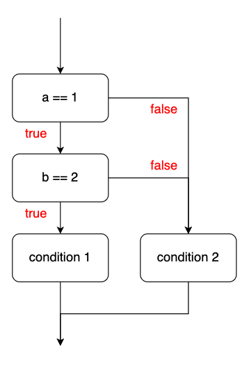
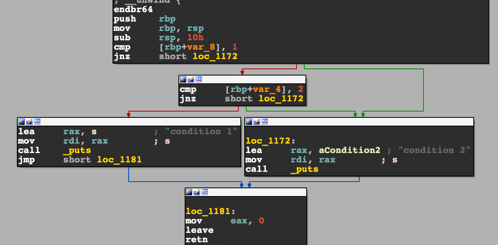
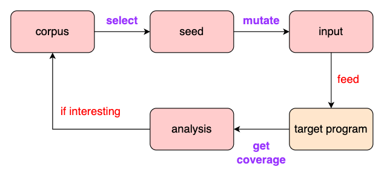

# [Day 2] Fuzzing 內部架構


簡單介紹一下 **basic block**。程式在執行時會因為不同的條件執行不同的程式碼，而不同條件主要就是以 `if` 來定義，以下方程式碼為例子，當 `a == 1 && b == 2` 條件滿足時會印出 `"condition 1"`，除此之外皆印出 `"condition 2"`。

```c
if (a == 1 && b == 2)
	puts("condition 1");
else
    puts("condition 2");
```


若將執行邏輯畫成圖會像下圖，而通常這種表示程式執行流程的圖就稱作 **control flow graph** (CFG)。每個方格都代表一個 basic block，被劃分成同塊 basic block 的程式碼一定會**從第一條 instruction 開始執行**，不會有其他程式碼透過  branch instruction 到達 basic block 中第一條之外的 instruction，並且保證在同一塊 basic block 內的 instruction 一定都會被執行到。




下圖為使用工具 (IDA) 產生出來的 instruction level 的 CFG，對照上述 basic block 的說明即可暸解：




---


回歸正題，整個 fuzzing 流程大致可以拆成三個 components，分別為： 1. seed selection、2. mutation、3. coverage。




> 建立在 Day1 上，**fuzzer.py** 與 **test.c** 分別做了一些更新

**corpus** 為過去曾經產生新 coverage 的所有 input，或是初始化時給定的 seed，以 **fuzzer.py** 為例 `inps = ['A', 'B']` 即是所有 seed，可視為 corpus。

不同的 seed 會有**不同的屬性**，像是 seed 執行速度或是產生的 coverage，而透過分析這些屬性來挑 seed 的演算法就稱作 **seed selection**。**fuzzer.py** 的 selection 演算法比較簡單，使用最舊的 seed 作為下個 input (1)。

之後挑選出來的 seed 會做 **mutate** 來增加隨機性，**fuzzer.py** 的 mutation 演算法會將挑出來的 seed 會加上一個隨機字元 (2) 作為最終的 **input**。

將 input 餵入 target program 後，**fuzzer.py** 使用輸出結果作為依據來判斷執行好壞。**test.c** 當輸入滿足特定條件時會分別輸出 `"AAA"` 與 `"BBB"`，這也代表當程式有輸出時，執行流程會更接近 bug，因此將其加到 corpus (變數 `inps[]`) 當中 (3)，在此可以將**輸出結果的多寡**視為 **coverage**，如果有輸出的話代表此 input 為 **interesting**。

雖然 coverage 的形式可以自己定義，但在大多情況下，執行越多程式碼代表越有可能執行到漏洞，因此通常 coverage 指的是**執行了多少程式碼**，而程式碼本身又以 basic block 所組成，所以需要透過某些方式在 basic block 執行前插入一段用來記錄的程式碼，此技術稱作**插樁 (instrumentation)**。

為了避免 mutate 效果不好導致 input 無法取得新的 coverage，因此有時候在 fuzzer 中會讓 corpus 有劇烈的變化 (4)，或是定期打亂 corpus，這樣可能會有意想不到的效果。


test.c:

```c
// gcc -o test test.c
#include <unistd.h>
#include <stdio.h>

int main()
{
    char input[8] = {0};
    read(STDIN_FILENO, input, 8);

    if (input[0] == 'A') {
        puts("AAA");
        if (input[1] == 'B') {
            puts("BBB");
            if (input[2] == 'C') {
                *((unsigned int *)0) = 0xdeadbeef; // bug
            }
        }
    }
    return 0;
}
```


fuzzer.py:

```python
import subprocess
import random

target = './test'
inps = ['A', 'B']
count = 1

while True:
    inp = inps[0] # (1)
    inp += random.choice(['A', 'B', 'C']) # (2)
    del inps[0]
    count += 1

    try:
        comp = subprocess.run([target], input=inp.encode(), capture_output=True, check=True)
        if comp.stdout != b'':
            inps.append(inp) # (3)
    except subprocess.CalledProcessError:
        print(f"bug found with input: '{inp}'")
        break

    if count % 100 == 0 or len(inps) == 0: # (4)
        inps = ['A', 'B']
```


因此一個 fuzzer 的好壞，通常是以： 1. **seed selection** 是否能挑出真正有意義的 seed、2. **mutate** 的隨機是否有效率、3. **coverage** 取得的方式是否會造成大量的 overhead。

