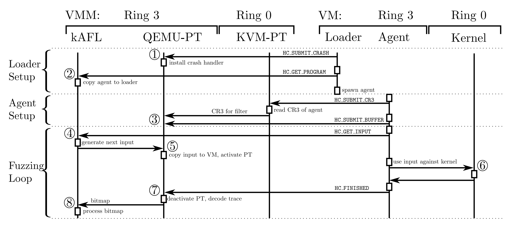

# [Day 23] OS fuzzer - kAFL 論文 - 設計框架 & 實驗結果

昨天花了滿大的篇幅介紹虛擬化技術，今天會著重在 kAFL 論文提出的設計架構。

### Design

kAFL 將整個系統分成三個 component：

- **kAFL-fuzzer**
  - **Loader** - 執行在虛擬機的 userspace，負責接收來自 fuzzer 的程式碼 (assembly code) 並執行，而這段程式碼也就對應不同的 agent
  - **Agent** - 呼叫一連串的 system call sequence，同時也負責接收由 fuzzer 傳入已經變異好的 payload
  - **Fuzzer** - 除了做 fuzzing strategy 之外，也包含建立執行環境、向 loader 發號施令
- **QEMU-PT** - 修改後的 QEMU，建立與虛擬機溝通的橋樑如 shared memory，同時也負責解析 Intel-PT packet，將執行結果送給 kAFL-fuzzer
- **KVM-PT** - 修改後的 KVM，用來設定 Intel-PT、接收 VM 傳送的 hypercall 命令

### Workflow

整個執行流程如下圖：

1. 運行在 VM 的 loader 會**執行 hypercall** 傳送 `HC_SUBMIT_CRASH` 命令，通知 QEMU-PT 為 VM 裝一個 crash handler，用來處理 VM kernel crash。同時當 QEMU-PT 收到此命令，也代表 loader 確實有執行起來
2. Loader 會在初始化後發送一個 `HC_GET_PROGRAM` 命令給 fuzzer，fuzzer 就會把 agent 的執行檔內容傳給 loader
3. Loader 被替換成 agent (by `execve()`) 後，agent 會透過 `HC_SUBMIT_CR3` 將存放 page table 位址的 cr3 暫存器的內容傳給 QEMU-PT，這樣 QEMU-PT 就可以直接修改記憶體來傳送 payload。處理後還會送一個 `HC_SUBMIT_BUFFER` 命令把用來存放 payload 的 buffer 位址傳給 QEMU-PT
4. Agent 用 `HC_GET_INPUT` 跟 fuzzer 請求輸入，而 fuzzer 就會進行 mutation 並產生 input，傳送給 QEMU-PT 做處理
5. QEMU-PT 有在步驟 3 取得 buffer 位址，因此直接將 payload 複製到 buffer 當中，同時也會通知 KVM-PT 開啟 Intel-PT 來蒐集 VM kernel code coverage
6. Agent 一檢查到 payload buffer 有資料，就會以此作為參數值來執行 system call
7. 執行結束後在送 `HC_FINISHED`，通知 QEMU-PT 此輪執行完畢，可以叫 KVM-PT 停止 Intel-PT
8. QEMU-PT 通知 KVM-PT 停止繼續 tracing，並解析 Intel-PT 的 packet，最後將結果送給 fuzzer 做分析

而後整個 kAFL 會不斷重複步驟 4~8，讓 host fuzzer 能夠以 agent 呼叫 syscall 產生的 coverage 為 feedback，不斷改進 input payload，藉此探索到更多的程式碼。

### Evaluation

實驗使用一台 Thinkpad laptop，擁有 i7-6700HQ@2.6GHz CPU 跟 32GB RAM，然後因為當時沒有太多的 kernel fuzzer，加上他們說因為實作的機制不相同，因此沒辦法與 syzkaller ，所以實驗結果通常都直接呈現。

單純就執行效率來說，論文實測 kAFL 每秒執行程式的次數能達到 6830 次，我是覺得這個實驗數據不準，或是使用了一些話術做包裝，因為 `hypercall` 本身是一個很昂貴的 instruction，從 VM trap 到 host 需要保存一次執行狀態，host 到 VM 又要載入原本的執行狀態，而執行一次程式要做 2 個 hypercall，但效能卻可以跟一些簡單操作的 userspace fuzzer 相同。也有可能是因為他沒有說明詳細的測試環境，說不定在他設計的測試環境中確實可以跑出不錯的效果。

然後如果有在看 fuzzing 相關的論文，不少篇都會提到不使用 Intel-PT 的原因在於處理 packet 會有一定的 overhead，不過處理 packet 造成多少額外的 overhead 並沒有提及，單純只有提到比現有的 decoder 好上不少。

最後，kAFL 的 agent 似乎只能 fuzzing kernel 的 filesystem，也就是執行一連串固定與 filesystem 溝通的 system call，mutation 的對象是參數內的資料。

### Conclusion

綜合來講，kAFL 整個框架設計帶給我滿大的啟發，當然感覺還是有很多可以優化的地方，但身為一個 OS fuzzer 的拓荒者之一，不論是虛擬化或是硬體蒐集 coverage，這樣的設計已經充分利用當時的技術，但因為沒辦法自定義 system call 的格式，加上依賴 QEMU 與 KVM 的版本，在可擴充性與攜帶性不足的情況下，使用人數漸漸不如 syzkaller。

## Source code

### Layout

首先 kAFL 論文在發布時使用的程式碼為 [RUB-SysSec](https://github.com/RUB-SysSec/kAFL) 組織所發佈的版本，但目前仍有在維護的版本則是 [IntelLabs](https://github.com/IntelLabs/kAFL) 所擁有，在此以前者的程式碼為主。整個 kAFL repo 根據功能拆成不同的目錄，而功能種類就跟論文介紹一樣：

- kAFL-Fuzzer
- QEMU-PT
- KVM-PT

---

明天會介紹 **QEMU-PT** 與 **KVM-PT** 的實作方法，究竟對現有的工具 QEMU 與 KVM 做了哪些 patch，是怎樣透過這些改動讓 host 能與 VM 按照論文所提出的方法傳遞資料。而後天會介紹 loader/agent/fuzzer 是如何共存在 kAFL-Fuzzer 目錄，也會再次介紹論文提出的執行流程與實作方法。

