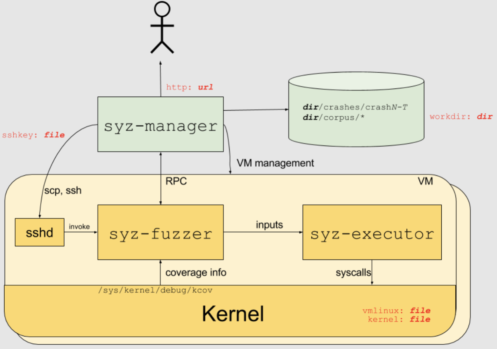
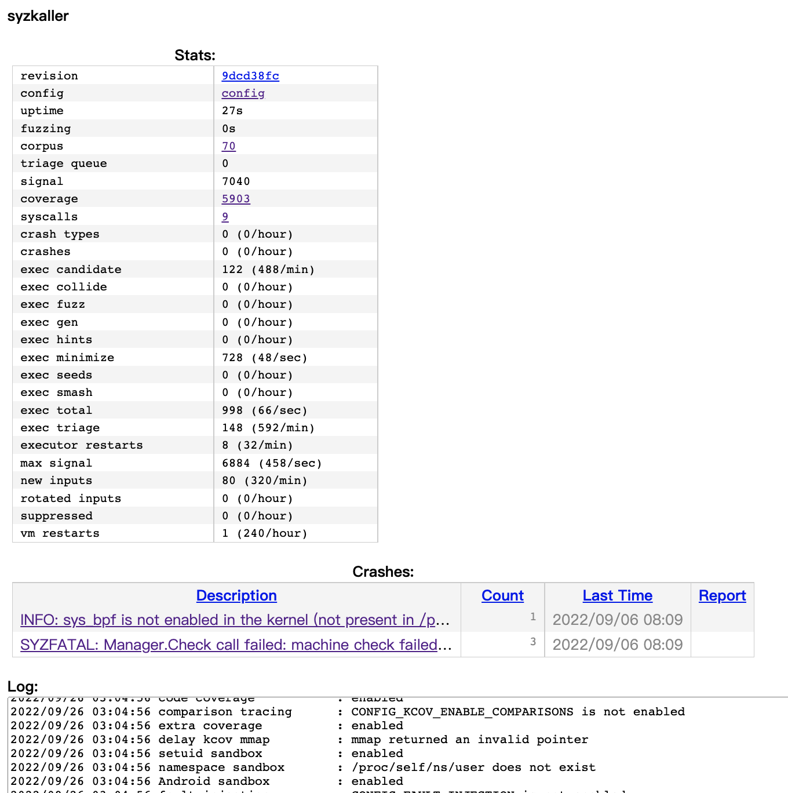

# [Day 26] OS fuzzer - syzkaller - 介紹 & 執行環境建置


先前有提到 [syzkaller](https://github.com/google/syzkaller) 可以說是目前最廣為使用的 OS fuzzer，不但整個部署的過程只需要下幾個命令，也提供使用者客製化執行環境，像是允許執行的 syscall、VM instance 個數、自定義 syscall 與呼叫 dependency 等等，並且他有清楚明瞭的使用者介面，讓使用者可以知道當下執行的狀態，包含 crash 發生的位置與錯誤回報、當前尚未執行的 seed，甚至還可以在原始碼中看各個 basic block 的執行次數。

如果好奇使用者介面提供了哪些功能，這邊提供一個開在外面的 [syzkaller server](https://elisa-builder-00.iol.unh.edu/syzkaller/) 給各位參考，同時 syzkaller 也有官方維護，不斷 fuzz 最新版本 kernel 的 [syzbot](https://syzkaller.appspot.com/)，如果研究人員想知道某個作業系統比較常發生錯誤的部分，也可以透過分析 syzbot 都在哪些地方找到漏洞來得知。

syzkaller 並沒有額外發論文，但其 [repo](https://github.com/google/syzkaller) 中有分享此設計曾經在哪些地方演講過，可以參考 [Tech talks and articles](https://github.com/google/syzkaller/blob/master/docs/talks.md)，接下來會對 syzkaller 做一些簡單的介紹，並將整個環境架設起來。


## Syzkaller

### Introduction

[syzkaller](https://github.com/google/syzkaller) 為 google 開發的 open source OS fuzzer，目前主要由 [dvyukov](https://github.com/dvyukov) 維護，有著部署快、使用簡單的優點，同時還支援多個作業系統。接下來介紹會以 fuzzing Linux 為主，下方為 syzkaller 的架構圖，主要分成三個 component，分別為 **syz-manager**、**syz-fuzzer** 以及 **syz-executor**：



- **syz-manager** - 執行在 host，主要用來執行 VM instance 與管理使用者介面
  - 一開始會將整個環境初始化，而後負責管理系統與輸出結果，比較少 fuzzer 相關的機制

- **syz-fuzzer** - fuzzer engine，負責執行 syz-executor 並接收 coverage 做分析
  - Fuzzer 會根據使用者的設定來產生 syscall sequence，之後傳送給 syz-executor 執行
  - 蒐集 coverage 的部分使用 kernel feature `KCOV`，因此不需要額外對 kernel 做 patch

- **syz-executor** - 負責執行 syscall sequence
  - 不斷等待 syz-fuzzer 傳來的 "program"，也就是一組 syscall 組合
  - 重複執行

除此之外 syzkaller 還有提供許多工具可以使用，像是復現 crash input，或是對 input 做最小化 (minimization) 等等，但這些工具不一定會使用到，就沒有列在架構圖上。其中編譯 kernel 時所使用 kernel config 只需要滿足 syzkaller 所使用的功能，其他部分都可以自己調整。


#### KCOV

蒐集 coverage 的方式也是 syzkaller 的一大特色，先前在 Day22 介紹 kAFL 時有稍微提到過，syzkaller 是用 `KCOV` 蒐集 coverage，而 `KCOV` 的開發人員之一就是 syzkaller 的維護者，這裡會稍微介紹一下 `KCOV`，細節部分可以參考 [KCOV documentation](https://docs.kernel.org/dev-tools/kcov.html)。

先介紹使用方式，參考下面的範例程式碼：

```c
#define KCOV_INIT_TRACE  _IOR('c', 1, unsigned long)
#define KCOV_ENABLE      _IO('c', 100)
#define KCOV_DISABLE     _IO('c', 101)
#define COVER_SIZE       (64<<10) // 0x10000

#define KCOV_TRACE_PC  0
#define KCOV_TRACE_CMP 1

int main(int argc, char **argv)
{
    // 用來蒐集 coverage 的介面
    // fd 只能用在目前的 thread
    fd = open("/sys/kernel/debug/kcov", O_RDWR);
    // 初始化 trace mode，設置 trace size
	ioctl(fd, KCOV_INIT_TRACE, COVER_SIZE);
    // 建立一塊 kernel 與 userspace 共享的記憶體空間
    cover = (unsigned long*)mmap(NULL, COVER_SIZE * sizeof(unsigned long),
                                 PROT_READ | PROT_WRITE, MAP_SHARED, fd, 0);
    // 開啟當前 thread 的 coverage collection
    // 除了 KCOV_TRACE_PC 之外，還有 KCOV_TRACE_CMP，
    // 用來蒐集 comparison 的資訊
	ioctl(fd, KCOV_ENABLE, KCOV_TRACE_PC);

    // reset coverage
    __atomic_store_n(&cover[0], 0, __ATOMIC_RELAXED);
    
    // 目標 syscall
    read(-1, NULL, 0);
    
    // 取得紀錄的位址數量
    n = __atomic_load_n(&cover[0], __ATOMIC_RELAXED);
    // 遍歷整個 buffer，印出走到的位址
    for (i = 0; i < n; i++)
        printf("0x%lx\n", cover[i + 1]);

    // 關閉當前 thread 的 coverage collection
	ioctl(fd, KCOV_DISABLE, 0);
    // 釋放資源
	munmap(cover, COVER_SIZE * sizeof(unsigned long)))
    close(fd);
    return 0;
}
```

背後的原理是 Day11 介紹的 `__sanitizer_cov_trace_pc()` 插樁，也就是每個 basic block 執行前都呼叫一次，而 KCOV 做的插樁內容如下，參考 linux kernel 的 [kcov.c](https://elixir.bootlin.com/linux/latest/source/kernel/kcov.c#L192)：

```c
void notrace __sanitizer_cov_trace_pc(void)
{
    // 取得 return address，也就是 basic block 的開頭
    unsigned long ip = canonicalize_ip(_RET_IP_);

    // 檢查當前 thread 是否需要正透過 KCOV trace
    t = current;
    if (!check_kcov_mode(KCOV_MODE_TRACE_PC, t))
        return;
    
    area = t->kcov_area;
    // pos 為目前記錄到的個數+1，也就是下一個個數
    pos = READ_ONCE(area[0]) + 1;
    // 如果大於 buffer size，就不處理
    if (likely(pos < t->kcov_size)) {
        // 更新個數
        WRITE_ONCE(area[0], pos);
        barrier();
        // 紀錄起來
        area[pos] = ip;
    }
}
```


### Setup

syzkaller 需要以下執行環境：

- Go compiler & C compiler
- Linux kernel
- syzkaller repo
- 一台實體/虛擬機


#### General packages & QEMU

```bash
sudo apt update
# 安裝一些使用到的 package
sudo apt install make flex bison libncurses-dev libelf-dev libssl-dev
# 安裝 qemu
sudo apt install qemu-system-x86
```


#### GO dependencies & C compiler

```bash
# Golang
wget https://dl.google.com/go/go1.17.6.linux-amd64.tar.gz
tar -xf go1.17.6.linux-amd64.tar.gz
export GOROOT=`pwd`/go
export PATH=$GOROOT/bin:$PATH

# C
sudo apt install gcc
```


#### syzkaller repo

```bash
git clone https://github.com/google/syzkaller
cd syzkaller
make
```

- 產生的執行檔會存放在目錄 syzkaller/bin/ 當中
- 如果需要跨 OS 或是指令集編譯，需要額外定義 `TARGETOS`、`TARGETVMARCH` 或 `TARGETARCH` 環境變數


#### Linux kernel

以 kernel 版本 5.14 為例：

```bash
git clone --branch v5.14 git://git.kernel.org/pub/scm/linux/kernel/git/torvalds/linux.git $KERNEL

# 產生預設 config
cd $KERNEL
make defconfig
make kvm_guest.config
make olddefconfig

# 修改 config，設定指定的 feature
# 參考下方
vim .config

# 更新 config
make olddefconfig

make -j`nproc`
```

syzkaller 所需要的 feautre，主要是打開 `KCOV` 蒐集 kernel coverage，以及 `KASAN` 來偵測記憶體錯誤：

```
CONFIG_KCOV=y
CONFIG_DEBUG_INFO=y
CONFIG_KASAN=y
CONFIG_KASAN_INLINE=y

CONFIG_CONFIGFS_FS=y
CONFIG_SECURITYFS=y
```


#### Image

建立一個 debian stretch linux image，作為 VM 的檔案系統：

```bash
sudo apt install debootstrap

export IMAGE="/path/to/image"
mkdir $IMAGE
cd $IMAGE/
wget https://raw.githubusercontent.com/google/syzkaller/master/tools/create-image.sh -O create-image.sh
chmod +x create-image.sh
./create-image.sh
```


#### Config

當以上的環境設置好後，就可以開始寫 syzkaller 的設定檔，以下為官方範例：

```
{
	"target": "linux/amd64",
	"http": "127.0.0.1:56741",
	"workdir": "$GOPATH/src/github.com/google/syzkaller/workdir",
	"kernel_obj": "$KERNEL",
	"image": "$IMAGE/stretch.img",
	"sshkey": "$IMAGE/stretch.id_rsa",
	"syzkaller": "$GOPATH/src/github.com/google/syzkaller",
	"procs": 8,
	"type": "qemu",
	"vm": {
		"count": 4,
		"kernel": "$KERNEL/arch/x86/boot/bzImage",
		"cpu": 2,
		"mem": 2048
	}
}
```

- **http** - 使用者介面開在 local 的 56741 port
- **image** - 先前產生的 image 位置
- **syzkaller** - syzkaller 專案的根目錄，這邊會因為安裝 syzkaller 的方式不同而有所不同

再來的就是一些 VM 設定，像是 VM 是使用 QEMU 運行、開啟四台 VM、每台的硬體資源與 kernel image 路徑等等。


#### Run

假設上個步驟寫的 config 名稱為 my.cfg，在此直接執行下列命令來運行整個 syzkaller：

```bash
./bin/syz-manager -config=my.cfg
```


執行後存取使用者介面 http://localhost:56741 (default)，會看到下圖，代表執行成功：




---


今天對 syzkaller 做簡單的介紹，並且將執行環境建立起來，讓讀者可以感受一下 syzkaller 跑起來的感覺。明天會介紹 syzkaller 用來定義 syscall 的語言 **syzlang**，並一探究竟 syz-manager 的實作方式。

