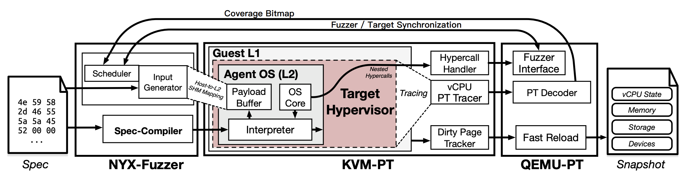
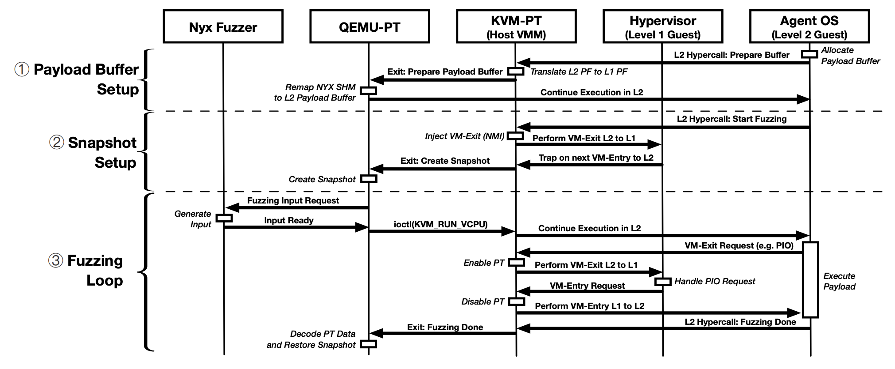

# [Day 29] Hypervisor fuzzer - Nyx

​	

相較於 OS fuzzer 來說，hypervisor fuzzer 的可能又比較冷門一點，除了需要 hypervisor 機制的背景知識，架構 fuzzing 的環境可能也相較複雜。不過 hypervisor 也是被廣為使用在現實生活，像是大多數的雲服務都是提供虛擬機給使用者使用，背後會由 hypervisor 處理一些高權限請求，同時也出現 center 版的 hypervisor，除了針對虛擬化技術做優化外，也提供企業更方便的管理介面。

Hypervisor 本身是做系統執行的模擬，但更多的是硬體設備的模擬處理，做的就是利用軟體來模擬硬體的行為。這些模擬出來的硬體設備也被稱作 virtual device，而 fuzzing 大多都會針對那些 virtual device 的處理，像是軟體實作是否與手冊上所描述的硬體行為相同。此外，虛擬硬體也會紀錄當前的狀態，因此 fuzzing 時也需要確保硬體環境是乾淨沒被污染的，否則復現時可能會出現問題。

Hypervisor 方面較為有名的 fuzzer 有兩個，分別為 [Nyx](https://github.com/nyx-fuzz/QEMU-Nyx) 以及 [Hypercube](https://github.com/RUB-SysSec/hypercube)。有趣的是，Nyx 跟 Hypercube 都是由 kAFL 的核心研究人員所開發，前者利用了類似於 kAFL 的系統框架來實作 hypervisor fuzz，後者則提出的客製化的作業系統來 fuzz hypervisor。不過後者雖然想法創新，但卻沒有公布原始碼，因此也無從得知程式碼架構，也不能復現實驗結果。此外，這次介紹都不會看原始碼，只會根據 paper 提出的機制做說明。

接下來會以 [Nyx 的論文](https://www.usenix.org/system/files/sec21summer_schumilo.pdf) 內容做介紹，了解 kAFL 的系統框架是如何移植到 hypervisor fuzzing 上，同時也會說明過程中所遇到的問題。

## Nyx

### Introduction

由於 hypervisor 的種類很多，有跑在 userspace 的 (e.g. QEMU)，有跑在 kernel space 的 (e.g. KVM)，還有取代作業系統來管理 VM 的 (e.g. exsi)，所以每篇論文針對的層級也不太一樣，再加上大多數的 hypervisor 因為是企業產品，所以都沒有原始碼，所以也需要在不同層級處理這種情況。

至今為止也有一些 hypervisor fuzzer 的實作，這邊稍微介紹一下：

- [VDF](https://www.cs.ucr.edu/~heng/pubs/VDF_raid17.pdf) - 插樁在 QEMU 當中特定 virtual device 的程式碼，然後模擬執行期間在用一大堆 test cases 對指定 virtual device，這樣得到的 coverage 就只限於目標
- [V-SHUTTLE](https://nesa.zju.edu.cn/download/pgn_pdf_V-SHUTTLE.pdf) - 針對 QEMU 與 virtualbox，會先對原始碼做靜態分析，對透過 direct memory access (DMA) 操作的不同型態結構做紀錄，並且 hook DMA 的操作。在動態時會根據記錄建置各自的 seed pool，DMA 操作時觸發 hook，將 seed pool 中的資料替換掉原本的

而 Nyx 設計架構適用於各種層級的 hypervisor，並且會對 hypervisor 做 snaphot，執行前會做重新載入，確保執行環境的乾淨。

### Design & Workflow

- **NYX-Fuzzer** - 整個 fuzzing engine
- **KVM-PT** - 支援 nested hypercall，執行 Guest L1 也就是 hypervisor，而 hypervisor 內部跑了一個 Agent OS (L2) 負責執行 payload
- **QEMU-PT** - 支援 fast snapshot reload 與解析 Intel-PT packet

除此之外 Nyx 還在 QEMU 中時做了 snapshot 的機制，客製化的 In-Memory Copy-On-Write 處理，實作方式為在 QEMU 內用一個 bitmap 記錄被污染的記憶體區塊，並在使用前儲存整塊記憶體內容，之後在執行完且要 reset VM 時，只要把原本的內容複製到污染區塊當中，就不需要將整個 VM 初始化。

---

參考下圖 Nyx 執行流程，hypervisor (L1 Guest) 替代了原先 kAFL 當中 target kernel 的位置，而 agent OS (L2 Guest) 替代了原本的 loader/agent：

如果 agent OS 需要送請求 QEMU 或 KVM，則都是直接呼叫 hypercall 傳送，而 nested hypercall 則是讓目標 hypervisor 可以接收到非請求的 hypercall 並做處理。下列根據上圖，說明各個步驟的行為：

1. Agent OS 會分配 payload buffer，並透過  傳給 QEMU-PT
2. 準備開始 fuzzing 前，agent OS 會通知 QEMU-PT，而 QEMU-PT 會建立 snapshot 並要求 Nyx fuzzer 將 payload 寫到 buffer 當中
3. Agent OS 收到 payload 後，會通知 KVM-PT 開始追蹤
4. 執行完 payload 後，agent OS 通知 KVM-PT 結束追蹤
5. QEMU-PT 解析完封包後，將結果交給 Nyx fuzzer 分析

### Evaluation

整體完勝 VDF，畢竟是 2017 年的論文，而跟 hypercube 比的話，在複雜的 device 中產生的 coverage 勝出不少，但簡單的 device 會比 hypercube 還要低，這主要跟 hypercube 半黑箱的實作機制有關係。

而 snapshot 的優化只比較了 native 執行速度與 QEMU 內建的 snapshot 機制，結果為完勝 QEMU 且接近 native，但這個機制聽起來能夠產生不錯的優化，不過是否接近 native 就不得而知。

雖然 Nyx 還有實作一種產生結構性 payload 的演算法，但一方面是我沒有很懂，一方面是要事先寫 spec，所以沒有特別拿出來說明，但大致上就是讓 fuzzer 生成的 payload 有特定的形式，這樣就能避免產生沒意義的 payload。

### Conclusion

論文上寫的效能一直讓我保持懷疑態度，因為就算多了 nested hypercall 的效能 overhead，但跑的還是很快，不過這也許是因為使用的硬體設備很好的關係。其他的部分除了 snapshot 的處理，大多等同於移植 kAFL 框架，一些處理與相關架構都很相似，沒什麼特別的部分。
