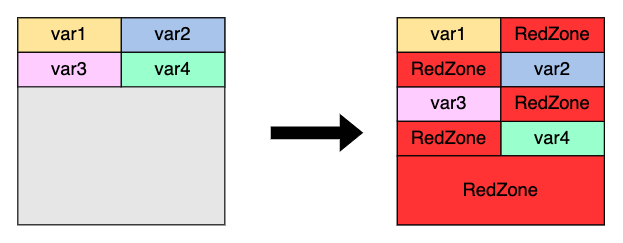
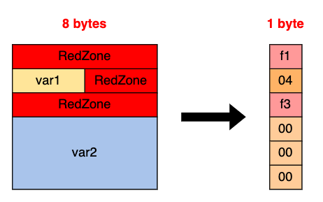

# [Day 3] 透過 Sanitizer 偵測程式異常


即使程式存在漏洞，也不一定會在執行到有漏洞的程式碼時觸發異常，以下面的程式碼為例子，如果使用者輸入的 `idx` 落在 0~99 之間則屬於正常範圍，超過 100 或是小於 0 才有可能造成執行異常。然而即便會有 out-of-bound write 的漏洞發生，但如果 `buf[idx]` 對應到的位址正好沒被使用到 (1)，即使執行到含有漏洞的程式碼片段，也不會產生回報給 fuzzer，因此 fuzzer 就會對這個部分的程式碼不感興趣，導致漏失了一個漏洞。

```c
char buf[100];
scanf("%d", &idx);
buf[idx] = '\0'; // (1)
```


為了能精準且快速的找出漏洞，compiler 的編譯參數中就多了 **Sanitizer** 的選項。透過 Sanitizer 可以在編譯時加上一些程式碼來追蹤程式 runtime 的執行狀況，提早偵測出程式異常並回報。不過因為會多加程式碼，所以執行效率會有明顯的影響，通常在 production 的版本中不會出現 sanitizer，fuzzing 時也不太會使用所有的 sanitizer，畢竟執行效率會直接影響 coverage。

常見的有 AddressSanitizer (+LeakSanitizer)、ThreadSanitizer、UndefinedBehaviorSanitizer 以及 MemorySanitizer，並且目前都由 google 的 [sanitizers](https://github.com/google/sanitizers/wiki) project 來 maintain，下面會參考 project 內容，分別介紹這四種 sanitizer 的功能與使用方法。


---

### AddressSanitizer

AddressSanitizer 又稱作 **ASAN**，整合了 LeakSanitizer (**LSAN**)，被用在 C/C++ 中偵測記憶體錯誤。因為能偵測到 out-of-bounds、use-after-free 與 memory leak 的發生，在大多數的 fuzzing 時都會使用，大概會造成 2x 的 slowdown。AddressSanitizer 有發表論文 [AddressSanitizer: A Fast Address Sanity Checker](https://static.googleusercontent.com/media/research.google.com/zh-TW//pubs/archive/37752.pdf)，較為簡潔的說明可以參考[此網站](https://suelan.github.io/2020/08/18/20200817-address-sanitizer/)的介紹，而下方只會做簡單的介紹。


變數會有自己的一塊記憶體空間儲存 value，也就是下方圖示 `var{1,2,3,4}` 各自的方格，而這些記憶體有個重要的特性：都是**連續分配**，因此如果變數 `var1` 有 out-of-bounds 的漏洞發生，有可能會影響到 `var{2,3,4}` 的 value，藉此改變原本程式的執行流程。

然而 ASAN 會在原本的連續記憶體中間插入 **red zone**，代表這些是不該被存取的記憶體區塊，如果 `var1` 會影響到 `var{2,3,4}`，那有很大的機會也會動到中間的 red zone，於是我們能透過檢查 red zone 被污染來判斷漏洞的發生。



因此在每次做 memory 存取前，會需要對存取位址做檢查，如果目標位址落在 red zone 就觸發 asan report，將錯誤原因 dump 出來。

實際會使用 **shadow memory** 的技術來做存取速度的優化，假設存取的記憶體位址為 0x87870000，首先會對位址右移三個 3 bits (1)，加上一個固定的 offset (2) 得到的記憶體位址即是 shadow memory。

而 shadow memory 裡面存放的值即是要存取的記憶體的型態，如果值為 00 的話就是正常的範圍， 01~07 代表記憶體本來就不對齊，因此還要考慮到記憶體被存取時的偏移 (4)。而 < 0 的值代表漏洞發生 (3)，並且不同的值代表不同的意義，舉例來說發生 **Freed heap region** (UAF) 漏洞時，值就會是 fd。

```c
void *a;
char magic;
long unsigned shadow_mem_addr;

a = (void *)0x87870000;
shadow_mem_addr = (long unsigned)a >> 3; // (1)
shadow_mem_addr += 0x7fff8000; // (2)
magic = *(char *)shadow_mem_addr;

if (magic < 0) // (3)
    dump_and_abort();

if ( ((long unsigned)a & 7) > magic) // (4)
    dump_and_abort();
```


一開始用 `var{1,2,3,4}` 做介紹，在此用 `var{1,2}` 示範 shadow memory 的應用：




而 **leak checker** (LSAN) 會在程式結束執行前執行另一個 process，並透過 ptrace 來 attach 當前的 process。接下來會去分析： 1. 全域變數、2.  正在執行 thread 的 stacks、3. 正在執行 thread 的 register、4. TLS 中存放的資料，這些記憶體位址中存放的值會形成 root set。之後 LSAN 會看 root set 的值是否有指向 heap block 的 pointer，並且 block 仍為 live memory，代表仍在被使用。


memory leak 範例：

```c
// gcc -fsanitize=address -o memory-leak memory-leak.c
#include <stdlib.h>

void *p;

int main() {
    p = malloc(7);
    p = 0;
    return 0;
}
```

輸出結果：

```
=================================================================
==1164786==ERROR: LeakSanitizer: detected memory leaks

Direct leak of 7 byte(s) in 1 object(s) allocated from:
    #0 0x7fb1207c3867 in __interceptor_malloc ../../../../src/libsanitizer/asan/asan_malloc_linux.cpp:145
    #1 0x55f8539bc1da in main (/tmp/memory-leak+0x11da)
    #2 0x7fb120510d8f in __libc_start_call_main ../sysdeps/nptl/libc_start_call_main.h:58

SUMMARY: AddressSanitizer: 7 byte(s) leaked in 1 allocation(s).
```


UAF 範例：

```c
// gcc -fsanitizer=address -o use-after-free use-after-free.c
#include <stdlib.h>

int main() {
    char *x = (char*)malloc(10 * sizeof(char*));
    free(x);
    return x[5];
}
```

輸出結果：

```
=================================================================
==1165010==ERROR: AddressSanitizer: heap-use-after-free on address 0x607000000105 at pc 0x5653d22d922b bp 0x7ffef65c3610 sp 0x7ffef65c3600
READ of size 1 at 0x607000000105 thread T0
    #0 0x5653d22d922a in main (/tmp/use-after-free+0x122a)
    #1 0x7f9bf2931d8f in __libc_start_call_main ../sysdeps/nptl/libc_start_call_main.h:58
    #2 0x7f9bf2931e3f in __libc_start_main_impl ../csu/libc-start.c:392
    #3 0x5653d22d9104 in _start (/tmp/use-after-free+0x1104)

...

SUMMARY: AddressSanitizer: heap-use-after-free (/tmp/use-after-free+0x122a) in main
Shadow bytes around the buggy address:
  ...
  0x0c0e7fff8010: fa fa 00 00 00 00 00 00 00 00 05 fa fa fa fa fa
=>0x0c0e7fff8020:[fd]fd fd fd fd fd fd fd fd fd fa fa fa fa fa fa
  ....
Shadow byte legend (one shadow byte represents 8 application bytes):
  Addressable:           00
  Partially addressable: 01 02 03 04 05 06 07
  ...
  Freed heap region:       fd
  ...
==1165010==ABORTING
```


---

### ThreadSanitizer

ThreadSanitizer 又稱作 **TSAN**，主要用來偵測 data race，造成的 slowdown 大概為 5x-15x。TSAN 關心兩種行為： 1. 記憶體存取事件、2. 同步事件，前者為存取記憶體的操作，像是讀寫記憶體，後者為 locking 與 happens-before。而 TSAN 會內部維持一個**狀態機**來監控這些行為，並根據狀態機的更新來檢測 data race 的發生，更多的細節可以參考[此篇文章](https://zhuanlan.zhihu.com/p/38687826)。


data race 範例：

```cpp
// g++ -fsanitizer=thread -o race race.cpp
#include <pthread.h>
#include <stdio.h>
#include <string>
#include <map>

typedef std::map<std::string, std::string> map_t;

void *threadfunc(void *p) {
    map_t& m = *(map_t*)p;
    m["foo"] = "bar";
    return 0;
}

int main() {
    map_t m;
    pthread_t t;
    pthread_create(&t, 0, threadfunc, &m);
    printf("foo=%s\n", m["foo"].c_str());
    pthread_join(t, 0);
}
```


---

### MemorySanitizer

MemorySanitizer 又稱作 **MSAN**，用來偵測未初始化記憶體的使用，有 2.5x 的 slowdown。未初始化代表在寫入某塊記憶體之前就做讀取，而 MSAN 會在 compile time 執行 **shadow propagation**，也就是在 compiler optimization pass 的過程中就對 IR instruction 使用的記憶體建立一個 **1-1 的 shadow memory**，如果 instruction 會存取到某塊記憶體，就會新增 "更新對應的 shadow memory 的 instruction"。shadow memory 是 bit-precise，因此 **bit** 有在使用的話，對應的 shadow bit 就會設為 0，否則初始值為 1，代表沒有被初始化。

由於會需要透過 LLVM pass 做 instrumentation，因此需要用 clang/clang++ 來編譯。


未初始化範例：

```c
// clang++ -fsanitize=memory -o umr umr.cpp
#include <stdio.h>

int main(int argc, char** argv) {
    int* a = new int[10];
    a[5] = 0;
    if (a[argc])
        printf("xx\n");
    return 0;
}
```


輸出結果：

```
==1174287==WARNING: MemorySanitizer: use-of-uninitialized-value
    #0 0x557751251550 in main /tmp/test.cpp:7:9
    #1 0x7fafa013dd8f in __libc_start_call_main csu/../sysdeps/nptl/libc_start_call_main.h:58:16
    #2 0x7fafa013de3f in __libc_start_main csu/../csu/libc-start.c:392:3
    #3 0x5577511c92a4 in _start (/tmp/umr+0x1e2a4) (BuildId: dd66654b82c0a369200de8e3f89642a1d07872f6)

SUMMARY: MemorySanitizer: use-of-uninitialized-value /tmp/test.cpp:7:9 in main
Exiting
```


