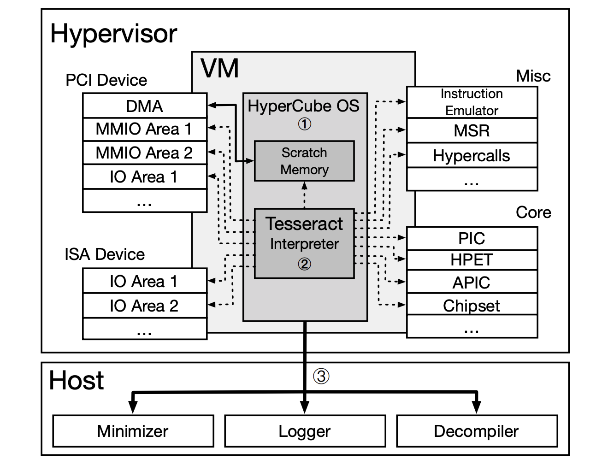
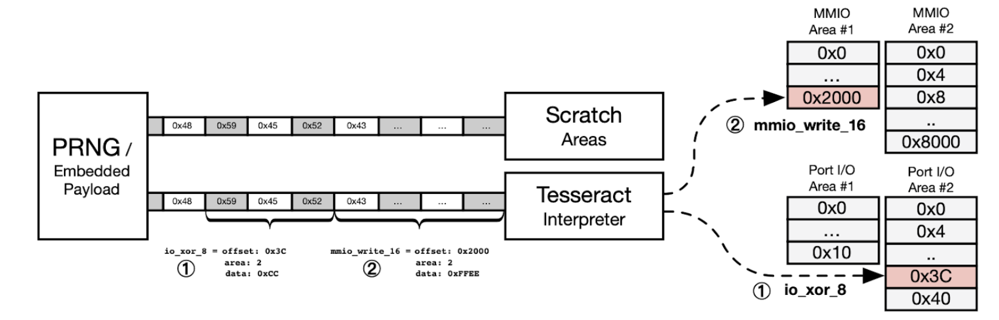

# [Day 30] Hypervisor fuzzer - Hypercube 與參賽心得

[Hypercube](https://www.ndss-symposium.org/wp-content/uploads/2020/02/23096-paper.pdf) 用了與 Nyx 截然不同的框架來對 hypervisor 做 fuzzing，今天就會介紹他在論文中提出的系統架構。而在文章最後，我也會分享一下參加鐵人賽的心得。

## Hypercube

Hypercube 的精華在於自己寫一個用來 fuzzing hypervisor 的作業系統，研究員稱他為 Hypercube-OS ，架構如下：

- **Host**
  - **Minimizer** - 最小化 payload
  - **Logger** - 紀錄執行狀態
  - **Decompiler** - 把執行的 bytecode 轉成 C code 方便觀察
- **HyperCube OS**
  - **Tesseract interceptor** - bytecode interpreter
  - **Simple heap management** - 簡單的記憶體管理機制
  - **Scratch memory** - 給 interpreter 使用，存放隨機資料

執行流程非常簡單，Hypercube OS 內部有一個 pseudo random number generaotr (PRNG) 不斷產生亂數到 scratch memory，而 interpreter 將這些亂數值視為 bytecode，從中執行對應的操作，像是 `mmio_write_16()` 或是 `io_xor_8()` 等等需要 hypervisor 硬體模擬來處理的操作，可以參考下圖：

執行過程中會紀錄產生的亂數資料，當觸發異常時會把這些亂數資料傳回 host，由 minimizer 找出關鍵觸發的部分，最後使用 decompiler 轉為 C code 分析。

---

雖然這樣的作法基本上不會考慮執行的 feedback，但這樣的好處就是執行效率快，對於簡單的 device 有非常好的效果，但是複雜的 device 或是比較深的邏輯處理就沒辦法走到。

## 參賽心得

​		因緣際會之下參加了這次的鐵人賽，一開始還在想說主題要選什麼，看了一下似乎過去沒有什麼人對模糊測試 (fuzzing) 做系統性的介紹，因此想說藉由這次機會分享一下，順便整理過去的知識。但這種主題其實滿學術的，雖然實際上有在使用，不過多半是研究人員、資安公司，或者是大公司的資安部門，一般人鮮少有機會接觸到，然後這東西背景知識又吃的有點重，一開始滿擔心沒有人看的。

​		在初期寫文章時，我認真想過介紹專案時到底需不需要放程式碼，但依照過去的經驗，聽不懂的東西看一下 code 可能就會開竅，而且知道怎麼實作的也很有趣，因此我盡量刪除多餘的程式碼，留下最精華的部分，並基本上逐行加上註解，並且盡量將使用到的技術做完整的說明，目標讓認真看或簡單看的人都能獲得一些知識，畢竟一些 kernel feature 或是虛擬化技術，已經被許多系統使用著。

​		不過寫到後期，感覺開始力不從心，不是忘記程式碼的意思，就是之前不熟悉，因此這系列文大概只有 50% 是吃老本，後面都是一邊寫，一邊學習、複習。而且這些實作介紹或是論文探討，最怕的就是誤會作者意思，然後還分享給其他人錯誤的資訊，因此我也很怕講錯知識，所以如果讀者發現有問題的地方，我都很歡迎在下方留言討論。

​		最後，因為過去我有被說過類似講話沒邏輯或是沒結構之類的話，因此我也不確定我在撰寫這些文章時字句是否通順，希望這系列文能清楚的分享這些技術與知識給其他人。

