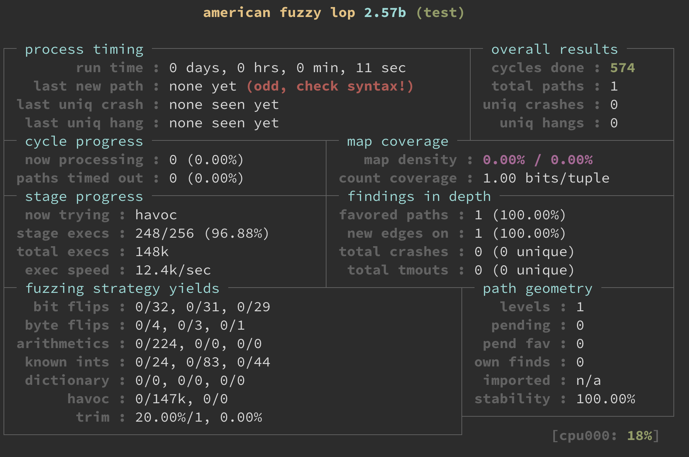

# [Day 4] 近代 fuzzer 始祖 - AFL - 總覽 & 編譯


Fuzzing 的概念也許已經存在一陣子，不過近期最有影響性的 fuzzer 應該公認為 [AFL](https://github.com/google/AFL)，實作直觀並且具有完整的框架，code base 不大之外程式碼也很好看懂，因此接下來的幾天會介紹 AFL 的實作，讓讀者對完整 Fuzzer 的實作有更深入的了解。

整個過程可以拆分成兩個部分： 1. 對於 target source code 的處理、2. 執行過程中 fuzzer 與 target 的互動。首先預計會花兩天的時間介紹第一個部分，而在之後花三、四天介紹第二部分。

AFL 對於 target source code 的處理又可以拆成： 1. compile、2. assemble 兩個部分，今天會著重在 **compile** 的處理。


### 建立執行環境

首先需要 clone 並且編譯 AFL 相關檔案：

```bash
cd ~
git clone https://github.com/google/AFL
cd ~/AFL
make
```

編譯後會在 ~/AFL 路徑底下產生多個執行檔：

```
|-- afl-as
|-- afl-clang -> afl-gcc
|-- afl-clang++ -> afl-gcc
|-- afl-fuzz
|-- afl-g++ -> afl-gcc
|-- afl-gcc
```

之後要跑 AFL 之前需要先編譯你的 target file，在此以 test.c 為例，參考註解說明執行以下命令：

```bash
# compile source code
~/AFL/afl-gcc -o test test.c

# generate seed
mkdir in && echo "seed" > in/seed

# setup environment
echo core | sudo tee /proc/sys/kernel/core_pattern
echo performance | sudo tee /sys/devices/system/cpu/cpu*/cpufreq/scaling_governor

# run fuzzer
~/AFL/afl-fuzz -i in -o out ./test
```

test.c：

```c
#include <stdio.h>
#include <unistd.h>

int main()
{
    int a;
    read(0, &a, 0x2);
    if (a == 0xdead)
        *(int *)0 = 0xdeadbeef;
    return 0;
}
```

執行 `~/AFL/afl-fuzz -i in -o out ./test` 後如果有看到以下畫面，就代表 AFL 有成功跑起來：




### Compile

建置環境時我們有使用到 `~/AFL/afl-gcc -o test test.c` 來編譯 test.c，實際上程式 afl-gcc 只是一般使用的 C compile **gcc** 的包裝，目的是要方便使用者使用，也就是最終 `~/AFL/afl-gcc XXX YYY` 會轉成 `gcc XXX YYY ZZZ ...` 去做執行，接下來從程式碼的邏輯來了解這個機制。

在 afl-gcc 的原始碼 afl-gcc.c 當中，最重要的是 function `edit_params()`，就如同他的名字，實際上是用來更新使用者傳進來的參數，其中一些相較不重要的程式碼片段已經刪剪或修改，如果有興趣可以找完整的 code 來看：

```c
static void edit_params(u32 argc, char** argv)
{
    u8 asan_set = 0;
    u8 *name;
    
    // cc_params array 會儲存要被執行指令的參數
    cc_params = ck_alloc((argc + 128) * sizeof(u8*));

    // 取得執行檔名稱，最後會得到 "afl-gcc"
    name = strrchr(argv[0], '/');
    if (!name) name = argv[0]; else name++;

    if (!strncmp(name, "afl-clang", 9)) {
        // clang 為另一個 C compiler，在此不討論
    } else {
        // ...
        else {
            // 這邊會把 gcc 加到要被執行指令的參數中
            u8* alt_cc = getenv("AFL_CC");
            cc_params[0] = alt_cc ? alt_cc : (u8*)"gcc";
        }
    }

    while (--argc) {
        // 取出每個執行參數做處理
        u8* cur = *(++argv);
        // 如果使用 sanitizer，會透過變數做紀錄
        if (!strcmp(cur, "-fsanitize=address") ||
            !strcmp(cur, "-fsanitize=memory")) asan_set = 1;
        cc_params[cc_par_cnt++] = cur;
    }
	
    // -B <path> 可以將 path 加到搜尋 compiler/assembler 的路徑當中
    cc_params[cc_par_cnt++] = "-B";
    cc_params[cc_par_cnt++] = as_path; // AFL 的路徑
	
    // 設置環境變數 AFL_USE_ASAN，代表有使用 sanitizer
    if (asan_set) {
        setenv("AFL_USE_ASAN", "1", 1);
    }

    // 加上額外的優化參數
    cc_params[cc_par_cnt++] = "-g";
    cc_params[cc_par_cnt++] = "-O3";
    cc_params[cc_par_cnt++] = "-funroll-loops";
    cc_params[cc_par_cnt++] = "-D__AFL_COMPILER=1";
    cc_params[cc_par_cnt++] = "-DFUZZING_BUILD_MODE_UNSAFE_FOR_PRODUCTION=1";
    cc_params[cc_par_cnt] = NULL;
}
```

最後變數 `cc_params[]` 會作為 function `execvp()` 的參數，執行以下指令：

```bash
gcc -o test test.c -B /home/user/AFL -g -O3 -funroll-loops -D__AFL_COMPILER=1 -DFUZZING_BUILD_MODE_UNSAFE_FOR_PRODUCTION=1
```

- -g: 為產生的執行檔加上 debug info
- -D: 定義 macro
- -O3: level3 的 optimization
