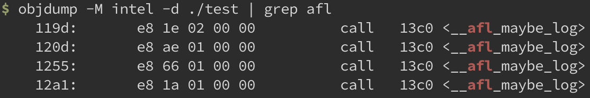

# [Day 5] 近代 fuzzer 始祖 - AFL - 插樁 & 組譯


### 插樁介紹

插樁 (instrumentation) 的核心概念為： 在保證原程式邏輯的完整性下，在程式中插入一些程式碼來蒐集 runtime 期間的執行狀態。以下方程式碼為例子，假設在執行期間變數 `test_var` 的值會持續更新，並且原本的程式碼 (1) 不會將此變數值印出。若想要觀察 `test_var` 在每個 function 呼叫時的值，就能透過插樁 (2)，讓 function 在執行原程式邏輯前先將變數值印出來：

```c
int test_var = 0;

// original (1)
void b() { ...; }
void a() { ...; }

// instrumented (2)
void b() { printf("test_var: %d\n", test_var); ...; }
void a() { printf("test_var: %d\n", test_var); ...; }
```

插樁的對象通常都具有相同屬性或類別，像是所有的 function、所有的 basic block，比較少針對單一目標。而插樁的程式碼通常只有幾行 assembly code，並不會做太複雜的操作，否則會有效能上的疑慮。

在 fuzzer 中，插樁被來用來蒐集 coverage，也就是紀錄多少程式碼被執行到。舉以下程式碼為例，function `a` 執行原程式邏輯前，會先執行插樁程式碼，記錄執行狀態到變數 `had_exec[]` (1)。在原程式邏輯執行結束後，就能分析這次執行所使用的 input 走到多少 function (2)，評估此 input 的價值：

```c
int had_exec[100] = {0};

void a()
{
    had_exec[0] = 1; // (1)
    // ...
}
void b() { had_exec[1] = 1; ...; }
void c() { had_exec[2] = 1; ...; }

int main()
{
    // ...
    if (had_exec[0]) // (2)
        puts("function a had been called");
}
```


### Assemble

昨天介紹到透過 afl-gcc 編譯時，底層其實會呼叫到 gcc 執行，執行指令：
```bash
gcc -o test test.c -B /home/user/AFL -g -O3 -funroll-loops -D__AFL_COMPILER=1 -DFUZZING_BUILD_MODE_UNSAFE_FOR_PRODUCTION=1
```

有趣的是 `-B /home/user/AFL`，這個 option 能夠使得 gcc 在找編譯相關的執行檔時，會將 /home/user/AFL 加到搜尋的路徑，也就是說 gcc 會嘗試在此路徑找 toolchain 中的 assembler **as** 來執行，簡單用 `ls` 看一下會發現 /home/user/AFL/as 實際上 softlink 到 /home/user/AFL/afl-as，也就是 AFL 自己的執行檔：

```bash
ls -al ~/AFL/as
lrwxrwxrwx 1 user user 6 Sep  6 14:55 /home/user/AFL/as -> afl-as
```

以下為最後執行到 afl-as 時的參數：

```bash
/home/user/AFL/as --gdwarf-5 --64 -o /tmp/ccKUZ8k0.o /tmp/cc9cCq4m.s
```


---

afl-as 的原始碼為 afl-as.c，實際上行為與 afl-gcc 大致相似，也是包裝執行參數以方便使用。除此之外 afl-as 還會做插樁，用來蒐集執行期間的 coverage。

afl-as 首先會先執行 function `edit_params()` 來調整參數，而後會執行 function `add_instrumentation()` 做插樁，最後執行 as 做組譯。


#### 調整參數

因為最終還是需要透過 as 去組譯，因此這邊會分析原本的執行參數，並轉成之後要執行 as 所使用到的參數：

```c
static void edit_params(int argc, char** argv)
{
    u8 *tmp_dir = getenv("TMPDIR"), *afl_as = getenv("AFL_AS");
    u32 i;
    
    // 用來放 as 參數，由此可知最後會呼叫到原生的 assembler "as"
    as_params = ck_alloc((argc + 32) * sizeof(u8*));
    as_params[0] = afl_as ? afl_as : (u8*)"as";

    for (i = 1; i < argc - 1; i++) {
        // 目標檔案為 32-bit or 64-bit
        if (!strcmp(argv[i], "--64")) use_64bit = 1;
        else if (!strcmp(argv[i], "--32")) use_64bit = 0;
        as_params[as_par_cnt++] = argv[i];
    }
    
    // 原本的 assembly filename
    input_file = argv[argc - 1];
    // 之後做插樁的 assembly filename
    modified_file = alloc_printf("%s/.afl-%u-%u.s", tmp_dir, getpid(),
                                 (u32)time(NULL));
    as_params[as_par_cnt++] = modified_file;
    as_params[as_par_cnt]   = NULL;
}
```

調整後的參數如下：

```bash
as --gdwarf-5 --64 -o /tmp/ccKUZ8k0.o /tmp/.afl-2863431-1662523292.s
```


#### afl-as 插樁

在 `add_instrumentation()` 較為重要的邏輯是判斷哪些 asm code 需要被插樁以及哪些不需要，不過判斷的邏輯相較複雜，因此在這邊只介紹實際上插樁要怎麼做，而判斷插樁的對象就簡單用註解帶過，至於插樁程式碼做了哪些事情會在下次說明：

```c
static void add_instrumentation(void)
{
    static u8 line[MAX_LINE];

    FILE* inf;
    FILE* outf;
    s32 outfd;

    inf = fopen(input_file, "r"); // 開啟原本的 asm file
    // 建立新的 asm file 並開啟
    outfd = open(modified_file, O_WRONLY | O_EXCL | O_CREAT, 0600);
    outf = fdopen(outfd, "w");

    // 將原本 asm file 的檔案一行行讀出來
    while (fgets(line, MAX_LINE, inf)) {
        /* 
         以下 asm code 會做插樁：
         ^main:      - function entry point (always instrumented)
         ^.L0:       - GCC branch label
         ^.LBB0_0:   - clang branch label (but only in clang mode)
         ^\tjnz foo  - conditional branches

		 以下不會：
         ^# BB#0:    - clang comments
         ^ # BB#0:   - ditto
         ^.Ltmp0:    - clang non-branch labels
         ^.LC0       - GCC non-branch labels
         ^.LBB0_0:   - ditto (when in GCC mode)
         ^\tjmp foo  - non-conditional jumps
     	*/
        if (no_need_instrument(line)) continue;
        
        // 在寫到新 asm file 前先將插樁程式碼 (trampoline_fmt_64) 寫進去
        fprintf(outf, trampoline_fmt_64, R(MAP_SIZE));
        // 最後在寫原本的 asm code
        fputs(line, outf);
    }
	
    // 加上其他 instrumentation code (main_payload_64)
    fputs(main_payload_64, outf);
}
```


做完插樁後會執行調整後的參數來編譯新的 asm file，最後產生出的執行檔 test 即是有插樁的版本，簡單用 objdump 就能看到許多以 **__afl** 為 prefix 的 function：




